# LLaMEA Noisy BBOB Optimization Algorithm Evolution

`aad-llm` is a research framework for automated algorithm discovery. It uses
[LLaMEA](https://github.com/XuYuey/LLM-Evolutionary-Algorithm) to evolve Python
implementations of continuous black-box optimizers, evaluates them on BBOB
(Black-Box Optimization Benchmarking) functions with configurable noise, and
then independently compares discovered champions with classical optimizers.

The project is notebook-first: configure an experimental matrix, synthesize
candidate algorithms with an LLM, benchmark saved champions, and analyse the
resulting traces statistically.

## What happens in an experiment

```text
Experiment configuration
  -> LLM generates or improves an optimizer implementation
  -> candidate executes in a guarded evaluation harness
  -> returned solution is validated and scored on the clean BBOB objective
  -> code and iteration telemetry are persisted
  -> best champion is independently benchmarked against CMA-ES, DE, and PSO
  -> ECDF metrics, hypothesis tests, and figures are produced
```

Generated algorithms receive only a black-box objective function, an evaluation
budget, and the problem dimension. The evaluator validates the returned point's
shape and bounds, then re-evaluates it on the un-noised objective. This makes
selection depend on the true quality of the returned solution rather than a
lucky noisy observation or a self-reported fitness value.

## Quick start

Requirements: Python 3.11–3.13 and either `uv` (recommended) or a standard
Python environment. A configured LLM provider is also required for synthesis.

### Local development with `uv`

```bash
uv sync --all-extras
uv run jupyter notebook
```

### Standard Python or remote Jupyter server

```bash
bash scripts/env.sh
jupyter notebook
```

Open the notebooks in the order below. The synthesis configuration has a large
default experiment matrix and a nominal one-million-evaluation candidate budget;
adjust `configs/synthesis.toml` before running a quick experiment.

## Notebook workflow

1. [01_noise.ipynb](notebooks/01_noise.ipynb) — inspect BBOB landscapes and
   heteroscedastic noise behaviour.
2. [02_synthesis.ipynb](notebooks/02_synthesis.ipynb) — run LLaMEA synthesis
   campaigns across the configured problem matrix.
3. [03_evaluation.ipynb](notebooks/03_evaluation.ipynb) — independently run
   champions and classical baselines over repeated trials.
4. [04_audit.ipynb](notebooks/04_audit.ipynb) — audit matrix coverage, pending
   work, failures, and resumable runs.
5. [05_analysis.ipynb](notebooks/05_analysis.ipynb) — perform non-parametric
   statistical analysis and create thesis/publication figures.

## Configuration

| File | Purpose |
| --- | --- |
| `configs/synthesis.toml` | Synthesis matrix, noise conditions, prompt strategies, budgets, retries, and process concurrency. |
| `configs/benchmark.toml` | Independent trial count, evaluation budget multiplier, timeout, and classical baselines. |
| `configs/problems.toml` | BBOB problem descriptions and groupings. |
| `configs/llms.toml` | Available local-model presets. |
| `.env` | Active LLM provider and local model/server settings. |

The default synthesis matrix covers BBOB functions 1, 8, 11, 15, and 21 across
2D, 3D, 5D, and 10D; clean and heteroscedastic-noise conditions; explicit and
implicit prompts; and several prompt strategies.

## LLM providers and local server

The LLM client supports configured providers, including OpenAI-compatible APIs
and local model servers. To use the bundled `llama.cpp` workflow:

```bash
bash scripts/env.sh
bash scripts/llm.sh start
```

Use `bash scripts/llm.sh` for the available model-server and model-download
commands. See [model configuration](docs/configuration/model_configuration.md)
for provider settings and presets.

## Persistence, recovery, and maintenance

- SQLite metadata is stored at `data/db.sqlite3` by default.
- Generated candidate source files and evolution checkpoint state are stored
  beneath `data/`.
- Synthesis checkpoints support warm-starting interrupted experiments; completed
  sessions clean up their checkpoint archive.
- Benchmark traces and analysis outputs are written under `results/`.

Manage the database or migration state with:

```bash
bash scripts/db.sh
bash scripts/db.sh upgrade
```

Clean generated artifacts and logs with:

```bash
bash scripts/clean.sh
```

## Project layout

```text
src/
  evolution/       LLM-driven algorithm synthesis: domain rules, campaigns,
                   LLaMEA adapter, BBOB/noise adapter, prompt construction,
                   and synthesis persistence
  benchmarking/    champion/baseline evaluation, trace processing, ECDF and
                   statistical analysis services
  shared/          configuration, SQLite infrastructure, and guarded dynamic
                   algorithm execution
notebooks/         interactive research workflow
configs/           synthesis, benchmark, problem, and LLM settings
data/              SQLite database, generated code, and checkpoints
results/           benchmark traces, tables, and figures
scripts/           environment, model-server, database, and cleanup helpers
tests/             unit and integration tests
docs/              architecture and methodology documentation
```

## Testing and quality checks

```bash
uv run pytest
uv run ruff check .
```

If Poe the Poet is installed, the equivalent project tasks are `poe test`,
`poe lint`, and `poe check`.

## Further documentation

- [System architecture](docs/architecture/system_architecture.md)
- [Execution and recovery flow](docs/architecture/execution_flow.md)
- [LLaMEA adapter architecture](docs/architecture/llamea_architecture.md)
- [Evaluator methodology](docs/evaluator_methodology.md)

```mermaid

flowchart TD

subgraph group_synthesis["Algorithm synthesis"]
  node_campaign["Campaign use case"]
  node_single_synthesis["Single synthesis"]
  node_synth_config["Synthesis config<br/>[repository.py]"]
  node_problem["Noisy BBOB<br/>[bbob.py]"]
  node_problem_analysis["Problem analysis<br/>[analyzer.py]"]
  node_noise["Noise strategy<br/>[noise_strategy.py]"]
  node_engine_port["Synthesis engine port<br/>[engine.py]"]
end

subgraph group_runtime["Candidate runtime"]
  node_llamea_runner["LLaMEA runner<br/>[runner.py]"]
  node_prompt_builder["Prompt builder<br/>[builder.py]"]
  node_llm_client["LLM client<br/>[client.py]"]
  node_candidate_eval["Candidate evaluator<br/>[evaluator.py]"]
  node_executor["Sandbox executor<br/>[executor.py]"]
end

subgraph group_benchmark["Benchmark evaluation"]
  node_evaluation["Trial evaluation"]
  node_champions["Champion selection"]
end

subgraph group_analysis["Audit and analysis"]
  node_audit["Coverage audit<br/>[audit_service.py]"]
  node_trace_repo["Trace ingestion"]
  node_statistics["Statistical analysis"]
  node_stats_engines["Analysis engines"]
end

subgraph group_persistence["Persistence"]
  node_code_repo["Algorithm code store<br/>[repository.py]"]
  node_synthesis_repo[("Synthesis repository<br/>[repository.py]")]
  node_database[("SQLite database<br/>[Database]")]
end

node_notebook_user(("Notebook user"))
node_llm_service{{"LLM backend"}}

node_notebook_user -->|"starts campaign"| node_campaign
node_notebook_user -->|"starts run"| node_single_synthesis
node_notebook_user -->|"runs trials"| node_evaluation
node_notebook_user -->|"audits coverage"| node_audit
node_notebook_user -->|"analyzes results"| node_statistics
node_campaign -->|"loads settings"| node_synth_config
node_campaign -->|"dispatches runs"| node_single_synthesis
node_single_synthesis -->|"runs synthesis"| node_engine_port
node_engine_port -->|"implemented by"| node_llamea_runner
node_llamea_runner -->|"builds prompts"| node_prompt_builder
node_llamea_runner -->|"requests generation"| node_llm_client
node_llm_client -.->|"calls model"| node_llm_service
node_llamea_runner -->|"evaluates candidates"| node_candidate_eval
node_candidate_eval -->|"executes code"| node_executor
node_candidate_eval -->|"evaluates on problem"| node_problem
node_problem -->|"applies noise"| node_noise
node_problem -->|"analyzes landscape"| node_problem_analysis
node_llamea_runner -->|"saves candidate code"| node_code_repo
node_single_synthesis -->|"persists run"| node_synthesis_repo
node_synthesis_repo -->|"reads and writes"| node_database
node_campaign -->|"checks run state"| node_synthesis_repo
node_evaluation -->|"loads champions"| node_champions
node_champions -->|"queries experiments"| node_database
node_evaluation -->|"loads algorithm code"| node_code_repo
node_evaluation -->|"executes trials"| node_executor
node_audit -->|"inspects champions"| node_champions
node_audit -->|"checks coverage"| node_synthesis_repo
node_statistics -->|"loads synthesis data"| node_synthesis_repo
node_statistics -->|"loads evaluation traces"| node_trace_repo
node_statistics -->|"computes analyses"| node_stats_engines

click node_campaign "https://github.com/nicola-ibrahim/aad_llm/blob/main/src/evolution/application/campaign_usecase.py"
click node_single_synthesis "https://github.com/nicola-ibrahim/aad_llm/blob/main/src/evolution/application/single_synthesis_usecase.py"
click node_synth_config "https://github.com/nicola-ibrahim/aad_llm/blob/main/src/evolution/infra/storage/synthesis_config/repository.py"
click node_problem "https://github.com/nicola-ibrahim/aad_llm/blob/main/src/evolution/infra/problems/bbob.py"
click node_problem_analysis "https://github.com/nicola-ibrahim/aad_llm/blob/main/src/evolution/infra/problems/analyzer.py"
click node_noise "https://github.com/nicola-ibrahim/aad_llm/blob/main/src/evolution/domain/services/noise_strategy.py"
click node_engine_port "https://github.com/nicola-ibrahim/aad_llm/blob/main/src/evolution/application/interfaces/engine.py"
click node_llamea_runner "https://github.com/nicola-ibrahim/aad_llm/blob/main/src/evolution/infra/engines/llamea/runner.py"
click node_prompt_builder "https://github.com/nicola-ibrahim/aad_llm/blob/main/src/evolution/infra/engines/llamea/prompts/builder.py"
click node_llm_client "https://github.com/nicola-ibrahim/aad_llm/blob/main/src/evolution/infra/llm/client.py"
click node_candidate_eval "https://github.com/nicola-ibrahim/aad_llm/blob/main/src/evolution/infra/engines/llamea/evaluator.py"
click node_executor "https://github.com/nicola-ibrahim/aad_llm/blob/main/src/shared/execution/executor.py"
click node_code_repo "https://github.com/nicola-ibrahim/aad_llm/blob/main/src/evolution/infra/storage/code/repository.py"
click node_synthesis_repo "https://github.com/nicola-ibrahim/aad_llm/blob/main/src/evolution/infra/storage/synthesis/repository.py"
click node_database "https://github.com/nicola-ibrahim/aad_llm/blob/main/src/shared/infra/database/engine.py"
click node_evaluation "https://github.com/nicola-ibrahim/aad_llm/blob/main/src/benchmarking/application/evaluation_service.py"
click node_champions "https://github.com/nicola-ibrahim/aad_llm/blob/main/src/benchmarking/infra/storage/champions_repository.py"
click node_audit "https://github.com/nicola-ibrahim/aad_llm/blob/main/src/benchmarking/application/audit_service.py"
click node_trace_repo "https://github.com/nicola-ibrahim/aad_llm/blob/main/src/benchmarking/infra/io/trace_repository.py"
click node_statistics "https://github.com/nicola-ibrahim/aad_llm/blob/main/src/benchmarking/application/statistical_service.py"
click node_stats_engines "https://github.com/nicola-ibrahim/aad_llm/tree/main/src/benchmarking/domain/services"

classDef toneNeutral fill:#f8fafc,stroke:#334155,stroke-width:1.5px,color:#0f172a
classDef toneBlue fill:#dbeafe,stroke:#2563eb,stroke-width:1.5px,color:#172554
classDef toneAmber fill:#fef3c7,stroke:#d97706,stroke-width:1.5px,color:#78350f
classDef toneMint fill:#dcfce7,stroke:#16a34a,stroke-width:1.5px,color:#14532d
classDef toneRose fill:#ffe4e6,stroke:#e11d48,stroke-width:1.5px,color:#881337
classDef toneIndigo fill:#e0e7ff,stroke:#4f46e5,stroke-width:1.5px,color:#312e81
classDef toneTeal fill:#ccfbf1,stroke:#0f766e,stroke-width:1.5px,color:#134e4a
class node_campaign,node_single_synthesis,node_synth_config,node_problem,node_problem_analysis,node_noise,node_engine_port,node_notebook_user toneBlue
class node_llamea_runner,node_prompt_builder,node_llm_client,node_candidate_eval,node_executor toneAmber
class node_evaluation,node_champions toneMint
class node_audit,node_trace_repo,node_statistics,node_stats_engines toneRose
class node_code_repo,node_synthesis_repo,node_database,node_llm_service toneIndigo

```


