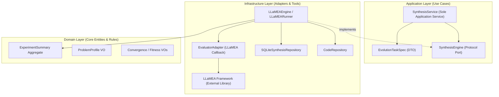

create a chatrs comparing different noise drops and performance

stick to 10^6 for all plots ECDF and convergance

use log scall on the y axis

tell to sove noise without telling in prompt

```mermaid
graph TD
    subgraph AppLayer ["Application Layer (Use Cases)"]
        Service["SynthesisService (Sole Application Service)"]
        TaskSpec["EvolutionTaskSpec (DTO)"]
        EnginePort["SynthesisEngine (Protocol Port)"]
    end

    subgraph InfraLayer ["Infrastructure Layer (Adapters & Tools)"]
        LLaMEAEngine["LLaMEAEngine / LLaMEARunner"]
        EvaluatorAdapter["EvaluatorAdapter (LLaMEA Callback)"]
        ExtLLaMEA["LLaMEA Framework (External Library)"]
        SQLiteRepo["SQLiteSynthesisRepository"]
        CodeRepo["CodeRepository"]
    end

    subgraph DomainLayer ["Domain Layer (Core Entities & Rules)"]
        Summary["ExperimentSummary Aggregate"]
        Profile["ProblemProfile VO"]
        Conv["Convergence / Fitness VOs"]
    end

    Service --> EnginePort
    Service --> TaskSpec
    LLaMEAEngine -.->|implements| EnginePort
    LLaMEAEngine --> EvaluatorAdapter
    EvaluatorAdapter --> ExtLLaMEA
    LLaMEAEngine --> Summary
    LLaMEAEngine --> SQLiteRepo
    LLaMEAEngine --> CodeRepo
```