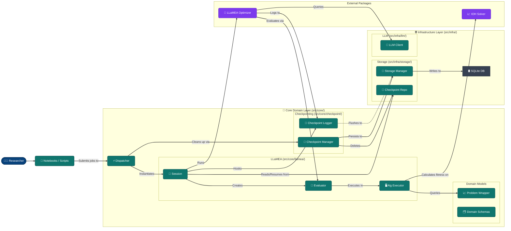
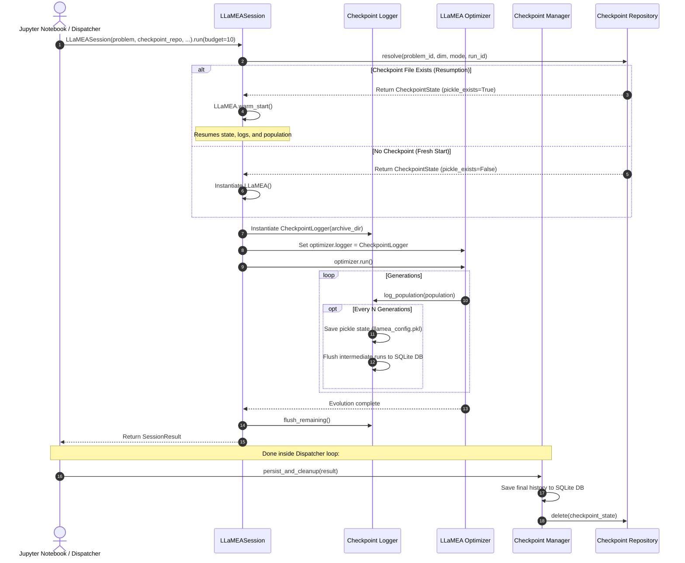

# System Architecture Design

This document details the component-level architecture of the `AAD_LLM` system, using the C4 Model (Level 2: Container/Component Diagram) represented via Mermaid. It details the boundaries, component responsibilities, and how execution, evaluation, database persistence, and crash recovery interact.

---

## 🗺️ C4 Component Diagram (Level 2)

---

## 🧩 Component Breakdown

### 1. Core Domain Layer (`src/core/`)
- **Dispatcher (`dispatcher.py`)**: Entry-point module running batch configurations of multiple evolution jobs concurrently under a `ThreadPoolExecutor`. Binds resources and runs database persistence and checkpoint cleanups.
- **LLaMEASession (`llamea/session.py`)**: Consolidated execution orchestrator. Instantiates or warm-starts the LLaMEA algorithm optimizer, runs the core generation iterations, logs outputs, and compiles final metrics.
- **Evaluator (`llamea/evaluator.py`)**: A LLaMEA-compliant evaluator. It executes generated algorithms, measures execution metrics (runtime, CPU cycles, error bounds), penalizes timeouts/crashes, and assigns fitness.
- **Algorithm Executor (`llamea/executor.py`)**: Uses isolated python environment execution tools to securely execute generated source code under strict `timeout` constraints.

#### Domain Models & Solvers
- **BBOB Runtime Wrapper (`problems/bbob.py`)**: Active wrapper loading underlying IOH benchmark problems. Handles bounds querying and validation, resets, and noise injection vectors during runtime evaluations.
- **Domain Schemas (`schema/`)**: Pydantic entities decoupled into granular domain concepts:
  - `problem.py`: Holds `ProblemProfile`.
  - `metrics.py`: Defines intermediate telemetry profiles (`ExecutionProfile`, `FitnessMetrics`, `CodeMetrics`, `ErrorProfile`, `ConvergenceProfile`).
  - `iteration.py`: Structures `IterationMetadata` describing individual candidate execution iterations.
  - `experiment.py`: Defines the aggregated summary entity `ExperimentSummary`.

### 2. Checkpoints & Recovery (`src/core/checkpoint/`)
- **Checkpoint Logger (`logger.py`)**: A custom logger intercepting LLaMEA execution. It writes pickle archives (`llamea_config.pkl`) to disk and flushes data to the repository every $N$ generations to avoid memory congestion.
- **Checkpoint Manager (`manager.py`)**: Coordinates loading, recovery, database persistence, and cleanup of checkpoints created during experiment executions.

### 3. Infrastructure Layer (`src/infra/`)
- **Storage Manager (`storage/manager.py`)**: A database repository facade exposing SQLite writes and managing filesystem blob savings via `CodeBlobSaver`.
- **Checkpoint Repository (`storage/checkpoint/repository.py`)**: Lower-level technical persistence engine managing filesystem checkpoint folder resolution, pickle saves, and serialization.
- **LLM Client (`llm/client.py`)**: Adapts client queries, timeouts, and providers to talk with local or external inference servers.

---

## 🔄 Execution Sequence & Resumption

