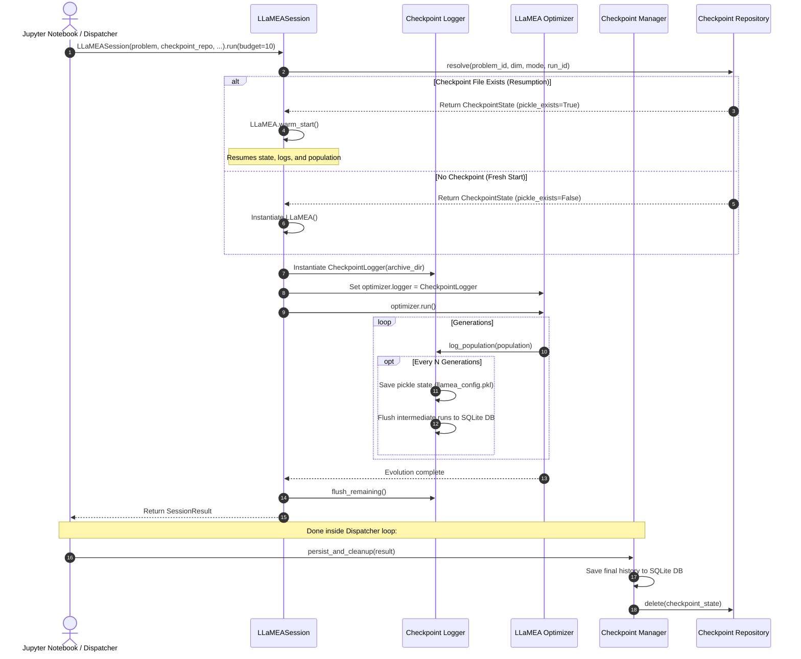

# Execution Sequence & Resumption

This document illustrates the execution lifecycle and checkpoint resumption mechanism in the `AAD_LLM` system.

```mermaid
sequenceDiagram
    autonumber
    actor User as Jupyter Notebook / Dispatcher
    participant Session as LLaMEASession
    participant Logger as Checkpoint Logger
    participant LLaMEA as LLaMEA Optimizer
    participant Manager as Checkpoint Manager
    participant CkptRepo as Checkpoint Repository

    User->>Session: LLaMEASession(problem, checkpoint_repo, ...).run(budget=10)
    Session->>CkptRepo: resolve(problem_id, dim, mode, run_id)
    
    alt Checkpoint File Exists (Resumption)
        CkptRepo-->>Session: Return CheckpointState (pickle_exists=True)
        Session->>Session: LLaMEA.warm_start()
        Note over Session: Resumes state, logs, and population
    else No Checkpoint (Fresh Start)
        CkptRepo-->>Session: Return CheckpointState (pickle_exists=False)
        Session->>Session: Instantiate LLaMEA()
    end

    Session->>Logger: Instantiate CheckpointLogger(archive_dir)
    Session->>LLaMEA: Set optimizer.logger = CheckpointLogger
    Session->>LLaMEA: optimizer.run()

    loop Generations
        LLaMEA->>Logger: log_population(population)
        opt Every N Generations
            Logger->>Logger: Save pickle state (llamea_config.pkl)
            Logger->>Logger: Flush intermediate runs to SQLite DB
        end
    end

    LLaMEA-->>Session: Evolution complete
    Session->>Logger: flush_remaining()
    Session-->>User: Return SessionResult

    Note over User, Manager: Done inside Dispatcher loop:
    User->>Manager: persist_and_cleanup(result)
    Manager->>Manager: Save final history to SQLite DB
    Manager->>CkptRepo: delete(checkpoint_state)
```
