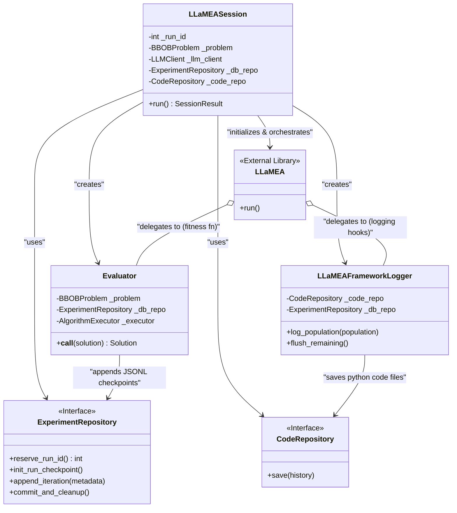
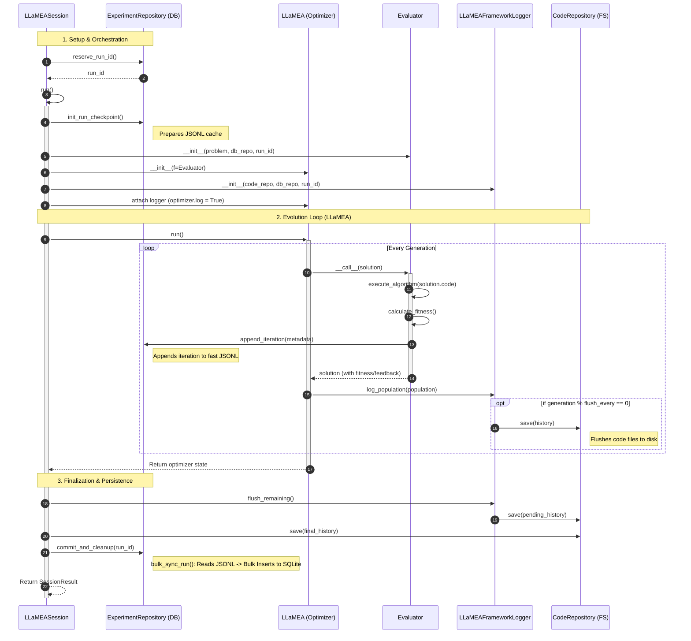

# LLaMEA Component Architecture (Decoupled Persistence)

This document outlines the decoupled architecture and communication flow between the orchestration layer (`LLaMEASession`), the execution layer (`Evaluator`), the integration layer (`LLaMEAFrameworkLogger`), and the persistence layers (`ExperimentRepository` and `CodeRepository`).

## 1. Class & Component Diagram

The following Mermaid class diagram illustrates the structural relationships, dependencies, and interfaces between the core components:

## 2. Detailed Communication Flow

The following sequence diagram illustrates the lifecycle of a single evolutionary run and how responsibilities are delegated among the classes over time:

