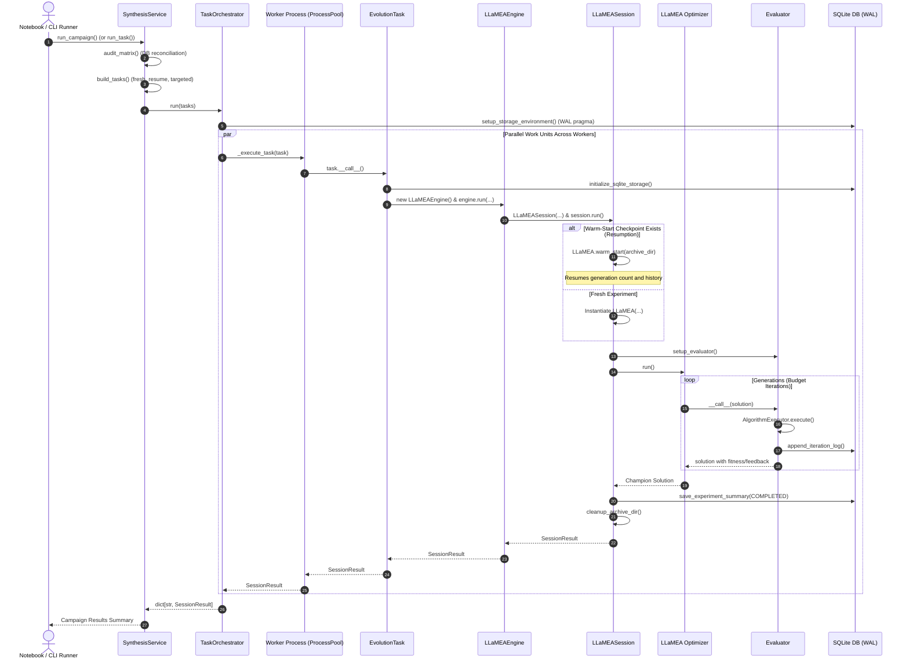

# Execution Sequence & Concurrency Lifecycle

This document illustrates the execution lifecycle, process concurrency, and warm-start resumption mechanisms in the `AAD_LLM` system.

---

## 1. Multi-Process Synthesis Execution Flow

The following sequence diagram captures the end-to-end flow from experiment campaign invocation down to isolated worker execution and result aggregation:

---

## 2. Crash Recovery & Resumption Lifecycle

1. **State Persistence**:
   During active evolution runs, checkpoints (`llamea_config.pkl`) are maintained in `data/evolution_state/{dim}D/std_{noise}/f{problem_id}/experiment_{id}/`.
2. **Crash Interruption Detection**:
   When `SynthesisService.audit_matrix()` inspects the database, any experiment whose status remains `running` is earmarked for resumption.
3. **Resumption Dispatch**:
   `SynthesisService._build_resume_task()` creates an `EvolutionTask` with `initial_iteration` set to the number of existing iterations already recorded in the database.
4. **Warm Start**:
   `LLaMEASession._create_synthesis_engine()` invokes `LLaMEA.warm_start()`, restores the existing population and generation count, attaches fresh `Evaluator` and `LLMClient` instances, and proceeds to complete the remaining iterations.
5. **Post-Run Cleanup**:
   Upon successful experiment completion (`experiment.complete()`), `_cleanup_archive_dir()` silently purges the checkpoint state files to prevent disk bloating.
