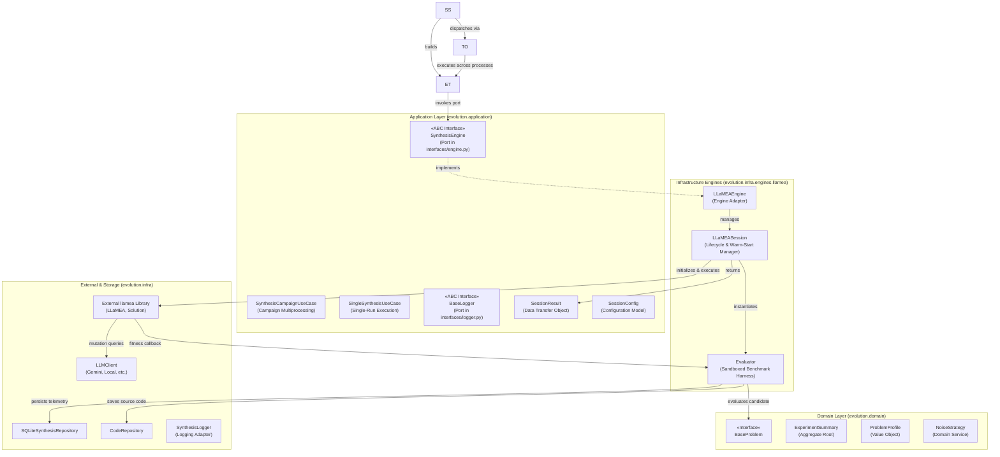
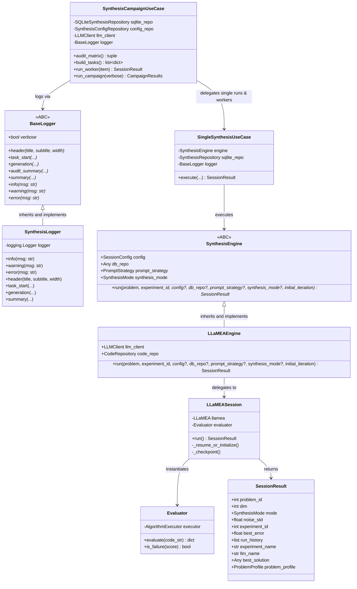
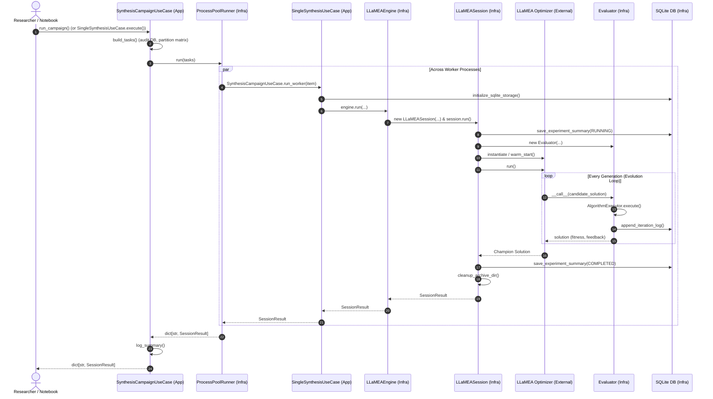

# LLaMEA Evolutionary Synthesis Architecture (Ports & Adapters)

This document details the decoupled Clean Architecture (Hexagonal / Ports & Adapters) design for the evolutionary algorithm synthesis bounded context in `AAD_LLM`.

---

## 1. Architectural Overview: Ports & Adapters (Hexagonal)

The application layer defines the use cases, task orchestrations, and abstract port interfaces. It has **zero dependencies** on third-party optimization libraries (`llamea`). Concrete adapters, engine harnesses, and evaluators live strictly in the infrastructure layer.

---

## 2. Core Component Responsibilities

| Layer | Component | Architectural Role | Responsibilities |
| :--- | :--- | :--- | :--- |
| **Application** | `SynthesisCampaignUseCase` | Application Use Case | Audits experiment matrix against SQLite DB, reconciles completed vs failed/interrupted runs, plans tasks, and orchestrates parallel multi-process dispatching via `ProcessPoolRunner`. |
| **Application** | `SingleSynthesisUseCase` | Application Use Case | Executes an isolated single synthesis experiment in-process without multiprocessing overhead. |
| **Application** | `SynthesisEngine` | Abstract Port (ABC) | Strategy interface defining `run(...)` contract implemented by concrete engines in `evolution.infra.engines`. |
| **Application** | `BaseLogger` | Abstract Port (ABC) | Defines base class contract for synthesis telemetry, progress reporting, and metric summaries. Located in `evolution.application.interfaces`. |
| **Application** | `SessionResult` | Response DTO | Immutable contract encapsulating the outcome of an evolutionary synthesis run (best error, run history, champion solution, problem profile). |
| **Infrastructure** | `LLaMEAEngine` | Concrete Synthesis Engine | Instantiates and coordinates `LLaMEASession` for a single run. |
| **Infrastructure** | `LLaMEASession` | Lifecycle Manager | Manages prompt injection, warm-start checkpointing (`llamea_config.pkl`), evaluator instantiation, LLaMEA loop execution, and status transitions. |
| **Infrastructure** | `Evaluator` | Evaluation Adapter | Wraps candidate Python code in `AlgorithmExecutor`, enforces timeouts and domain bounds, penalizes crashes/infeasibilities, captures runtime feedback, and persists telemetry to SQLite. |
| **Infrastructure** | `SynthesisLogger` | Logging Adapter | Implements `BaseLogger` using Python's standard `logging.Logger` with ANSI colors and formatted banners. |

---

## 3. Class & Interface Diagram

---

## 4. Execution Flow & Concurrency Sequence

---

## 5. Key Architectural Guarantees

1. **Clean Service & Task Separation**:
   `SynthesisCampaignUseCase` acts as the planning and multiprocessing orchestrator (`audit_matrix`, `build_tasks`, `run_campaign`), while `SingleSynthesisUseCase` encapsulates clean in-process execution of a single run.
2. **Process Isolation & Thread-Safety**:
   Each worker process runs with its own isolated SQLite connection operating under `journal_mode=WAL` and `busy_timeout=60000`, preventing lock contention and database corruption.
3. **Robust Warm-Start & Checkpointing**:
   State is pickled to `evolution_state/` each generation. If interrupted, `LLaMEASession` warm-starts from `llamea_config.pkl` and seamlessly resumes generation counts without duplicated iterations.
4. **No Legacy Aliases / Clean Canonical Contracts**:
   Zero backwards-compatibility shims or class aliases are maintained. All callers interact directly with canonical services (`SingleSynthesisUseCase`, `SynthesisCampaignUseCase`, `BaseLogger`, `LLaMEAEngine`, `SynthesisLogger`).
