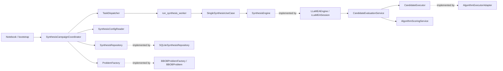

# Evolutionary Synthesis Architecture

The synthesis bounded context follows a practical ports-and-adapters structure.
Notebooks compose concrete infrastructure adapters and pass them into application
use cases; the application and domain do not import the infrastructure package.

```mermaid
flowchart LR
    Notebook[Notebook / bootstrap] --> Coordinator[SynthesisCampaignCoordinator]
    Coordinator --> RepoPort[SynthesisRepository]
    Coordinator --> ConfigPort[SynthesisConfigReader]
    Coordinator --> ProblemPort[ProblemFactory]
    Coordinator --> DispatchPort[TaskDispatcher]
    DispatchPort --> Worker[run_synthesis_worker]
    Worker --> Single[SingleSynthesisUseCase]
    Single --> EnginePort[SynthesisEngine]
    EnginePort -. implemented by .-> LLaMEA[LLaMEAEngine / LLaMEASession]
    LLaMEA --> CandidateService[CandidateEvaluationService]
    CandidateService --> ExecutorPort[CandidateExecutor]
    CandidateService --> Scoring[AlgorithmScoringService]
    ExecutorPort -. implemented by .-> Sandbox[AlgorithmExecutorAdapter]
    RepoPort -. implemented by .-> SQLite[SQLiteSynthesisRepository]
    ProblemPort -. implemented by .-> BBOB[BBOBProblemFactory / BBOBProblem]
```

## Responsibilities

| Layer | Components | Responsibility |
|---|---|---|
| Domain | `ExperimentSummary`, value objects, `NoiseStrategy`, `AlgorithmScoringService` | Scientific state and scoring policy: objective gap, fitness, failure tiers, and noise calculations. |
| Application | `SynthesisCampaignCoordinator`, `SingleSynthesisUseCase`, `CandidateEvaluationService`, interfaces | Reconcile campaign state, plan work, coordinate candidate execution, and construct evaluation results. |
| Infrastructure | `LLaMEAEngine`, `Evaluator`, BBOB and SQLite adapters, executor, process dispatcher, logger | Adapt IOH, LLaMEA, SQLite/files, generated-code execution, and worker processes to application contracts. |
| Entry points | `notebooks/02_synthesis.ipynb` and bootstrap code | Construct the infrastructure adapters and inject them into application use cases. |

Generated candidate execution, timing, and traceback capture happen in the
application evaluation workflow through the `CandidateExecutor` port. Objective-gap
and fitness policy live in `AlgorithmScoringService`, and synthesis plus benchmark
evaluation use that same scoring rule. The LLaMEA `Evaluator` is an infrastructure
adapter: it translates LLaMEA solutions to application calls and persists iteration
telemetry through the repository port.

## Campaign lifecycle

`SynthesisCampaignCoordinator` reads typed application configuration and a
`SynthesisRepository`, audits requested conditions, and builds typed `CampaignTask`
payloads. It submits those payloads through `TaskDispatcher`. The module-level
`run_synthesis_worker` is the process-pool entry point so it remains pickleable; each
worker delegates one task to `SingleSynthesisUseCase`.

`LLaMEAEngine` implements the `SynthesisEngine` port and manages LLaMEA session state,
prompts, checkpoint restoration, and the LLaMEA optimization loop. The domain and
application layers have no imports from `evolution.infra`; adapter construction is
explicit at the notebook/bootstrap boundary. There are no compatibility shims or
package-level legacy aliases.
