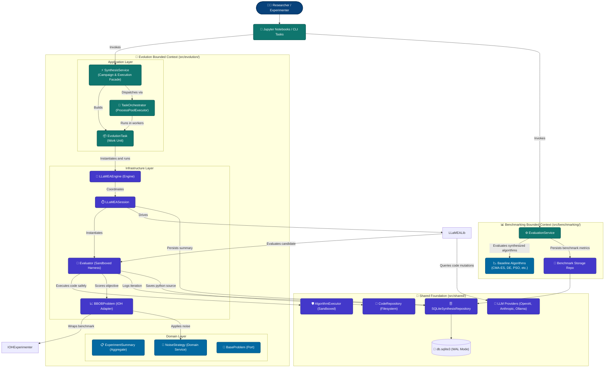

# System Architecture Design

This document details the component-level architecture of the `AAD_LLM` system, using the C4 Model (Level 2: Container/Component Diagram) represented via Mermaid. It details the bounded contexts, component responsibilities, and how evolutionary synthesis, benchmark evaluation, database persistence, and LLM inference interact.

---

## 1. 🗺️ C4 Component Diagram (Level 2)

---

## 2. 🧩 Bounded Contexts & Layer Breakdown

### A. Evolution Bounded Context (`src/evolution/`)
- **Application Layer (`src/evolution/application/`)**:
  - `SynthesisService`: Primary application facade for auditing database experiments, filtering completed vs incomplete runs, generating task matrices, and triggering execution (`run_task` or `run_campaign`).
  - `TaskOrchestrator`: Multi-process execution pool using Python's `ProcessPoolExecutor`. Ensures database WAL mode and busy timeout handling.
  - `EvolutionTask`: Self-contained, picklable unit of work isolating database connections and executing `LLaMEAEngine` directly per worker process.
  - `BaseLogger`: Abstract Base Class (ABC) defining logger port interface with default domain telemetry routing.
  - `SessionResult`: Strongly-typed DTO carrying execution outcomes.
- **Domain Layer (`src/evolution/domain/`)**:
  - `BaseProblem`: Abstract problem contract.
  - `ExperimentSummary`: Aggregate root capturing the lifecycle, metadata, and status of an evolutionary experiment.
  - `NoiseStrategy`: Domain service calculating deterministic, homoscedastic, and heteroscedastic noise perturbations.
- **Infrastructure Layer (`src/evolution/infra/`)**:
  - `engines/llamea/`: Evolutionary synthesis engine and session management (`LLaMEAEngine`, `LLaMEASession`, `Evaluator`).
  - `problems/bbob.py`: Concrete IOHexperimenter problem adapter implementing `BaseProblem`.
  - `storage/`: SQLite database storage (`SQLiteSynthesisRepository`) and filesystem Python source archive (`CodeRepository`).

### B. Benchmarking Bounded Context (`src/benchmarking/`)
- `EvaluationService`: Evaluates champion synthesized algorithms against classical baseline algorithms (e.g. CMA-ES, Differential Evolution, Particle Swarm Optimization).
- `BenchmarkRunRepository`: Manages evaluation runs, convergence data, and comparison metrics.

### C. Shared Kernel (`src/shared/`)
- `AlgorithmExecutor`: Sandboxed runtime execution harness with timeout enforcement (`SIGALRM` / `multiprocessing`) and exception capture.
- `database`: SQLite connection factory with WAL mode, busy timeout, and schema initialization.
