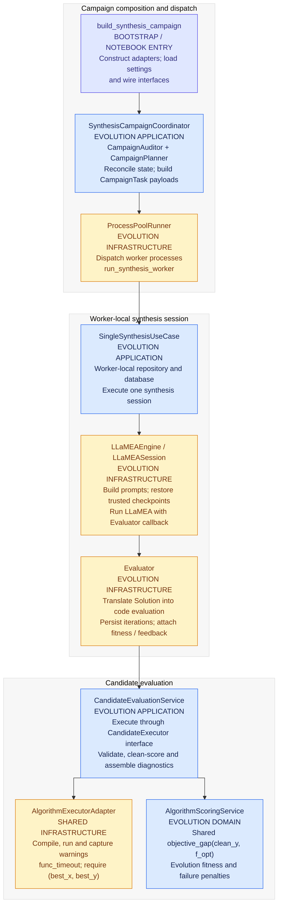
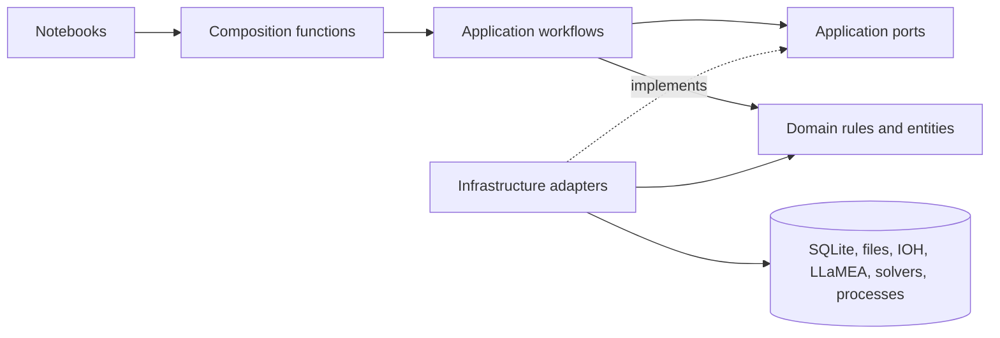

# System architecture

[Documentation map](../README.md) · [Project README](../../README.md)

A modular monolith with two workflow contexts: **evolution** and **benchmarking**.
Audit is a capability within those contexts; notebooks own presentation.

## Workflow overview

[Workflow overview](../../README.md#level-0--workflow-overview) ·
[Detailed system diagram](../../README.md#level-1--detailed-system-view) ·
[Level 0 Mermaid source](system_overview.mmd) ·
[Level 1 Mermaid source](system_diagram.mmd)

## Synthesis collaboration


```mermaid
%%{init: {"theme":"base","themeVariables":{"background":"#f2e6ff","lineColor":"#333333","fontFamily":"Arial, Helvetica, sans-serif","clusterBkg":"#f7f7f7","clusterBorder":"#dedede"},"flowchart":{"curve":"stepAfter","nodeSpacing":32,"rankSpacing":48}}}%%
flowchart TD
    accTitle: Synthesis collaboration
    accDescr: Campaign composition dispatches worker-local synthesis sessions; LLaMEA delegates candidate evaluation to shared execution and evolution scoring.
    subgraph Campaign["Campaign composition and dispatch"]
        direction LR
        Bootstrap["build_synthesis_campaign<br/>BOOTSTRAP / NOTEBOOK ENTRY<br/>Construct adapters; load settings<br/>and wire interfaces"]
        Coordinator["SynthesisCampaignCoordinator<br/>EVOLUTION APPLICATION<br/>CampaignAuditor + CampaignPlanner<br/>Reconcile state; build CampaignTask payloads"]
        Dispatcher["ProcessPoolRunner<br/>EVOLUTION INFRASTRUCTURE<br/>Dispatch worker processes<br/>run_synthesis_worker"]
        Bootstrap --> Coordinator --> Dispatcher
    end
    subgraph Session["Worker-local synthesis session"]
        direction LR
        UseCase["SingleSynthesisUseCase<br/>EVOLUTION APPLICATION<br/>Worker-local repository and database<br/>Execute one synthesis session"]
        Engine["LLaMEAEngine / LLaMEASession<br/>EVOLUTION INFRASTRUCTURE<br/>Build prompts; restore trusted checkpoints<br/>Run LLaMEA with Evaluator callback"]
        Evaluator["Evaluator<br/>EVOLUTION INFRASTRUCTURE<br/>Translate Solution into code evaluation<br/>Persist iterations; attach fitness / feedback"]
        UseCase --> Engine --> Evaluator
    end
    subgraph Candidate["Candidate evaluation"]
        direction TB
        Evaluation["CandidateEvaluationService<br/>EVOLUTION APPLICATION<br/>Execute through CandidateExecutor interface<br/>Validate, clean-score and assemble diagnostics"]
        Executor["AlgorithmExecutorAdapter<br/>SHARED INFRASTRUCTURE<br/>Compile, run and capture warnings<br/>func_timeout; require (best_x, best_y)"]
        Scoring["AlgorithmScoringService<br/>EVOLUTION DOMAIN<br/>Shared objective_gap(clean_y, f_opt)<br/>Evolution fitness and failure penalties"]
        Evaluation --> Executor
        Evaluation --> Scoring
    end
    Dispatcher --> UseCase
    Evaluator --> Evaluation
    classDef application fill:#dbeafe,stroke:#2563eb,color:#172554;
    classDef infrastructure fill:#fef3c7,stroke:#d97706,color:#78350f;
    classDef composition fill:#e0e7ff,stroke:#4f46e5,color:#312e81;
    class Bootstrap composition;
    class Coordinator,UseCase,Evaluation,Scoring application;
    class Dispatcher,Engine,Evaluator,Executor infrastructure;
```

Arrows show runtime calls/delegation, not permission for core modules to import adapters.
Fitness and feedback return through the Evaluator callback.
Configuration, repositories, problem factory and LLM client are injected collaborators;
they remain visible in the detailed system diagram rather than repeated as separate
nodes in this focused view.

## Dependency direction


```mermaid
flowchart LR
    Entry[Notebooks] --> Bootstrap[Composition functions]
    Bootstrap --> App[Application workflows]
    App --> Ports[Application ports]
    App --> Domain[Domain rules and entities]
    Infra[Infrastructure adapters] -. implements .-> Ports
    Infra --> Domain
    Infra --> External[(SQLite, files, IOH, LLaMEA, solvers, processes)]
```

Solid arrows describe dependencies/composition; the dashed edge means an adapter
implements an interface. Application code does not import its concrete adapter.

| Owner | Responsibilities |
| --- | --- |
| Evolution | Prompts, campaigns, iterations, feedback, fitness penalties and synthesis recovery. |
| Benchmarking | Champion selection, trial validity/resumption, audit, reliability, ECDF and transfer. |
| Shared foundation | BBOB/noise definitions, objective gap, problem capabilities, execution and database adapters. |
| Notebooks / bootstrap | Composition, labels, Plotly figures and explicit exports. |

Neither context's application/domain imports the other context. Shared code imports
neither context. Benchmarking infrastructure may read synthesis records through
read-only adapters; evolution owns synthesis writes. Database sessions are short-lived,
with worker-local engines and the existing SQLite WAL configuration.

[Execution and recovery](execution_flow.md) ·
[Evaluation protocol](../evaluation_protocol.md) ·
[Analysis workflows](../../notebooks/analysis/README.md)

<details>
<summary>Module ownership, persistence and implementation notes</summary>

## Context map and ownership

This is a modular monolith with two workflow contexts, not independent services.

```text
Notebook dashboards / figures / exports
                  ↓ composition in bootstrap
        Evolution                 Benchmarking
    synthesis + campaign       selection + evaluation + analysis
                  ↓                    ↓
       Shared scientific rules and runtime infrastructure
```

Evolution owns prompts, generation modes, experiment/iteration semantics, fitness
penalties, and campaign coverage. Benchmarking owns champion ranking, trial
protocols, condition validity, benchmark coverage, reliability, and transfer studies.
Audit and analysis are workflows, not a third bounded context. Persistence and
candidate runtime are supporting infrastructure, not business contexts.

Shared code must not depend on either context. Neither context's domain or
application imports the other context. Bootstrap may compose both. Benchmarking's
read-only SQLite adapters deliberately consume synthesis-owned table projections;
they must not write synthesis state or invoke synthesis workflows. The ORM schema
stays in shared infrastructure for this single-database application; evolution owns
its synthesis-table meaning and writes. Benchmark traces/provenance belong to
benchmarking. No database/schema migration is required.

## Dependency direction

The dependency rule for core code is inward: domain code owns scientific rules
and may use numerical/data-model libraries, but does not depend on infrastructure
or application workflows; application code depends on domain and application
ports; infrastructure depends inward on those contracts and outward on external
libraries. Notebook/bootstrap code constructs concrete adapters. The dotted adapter
relationship is runtime wiring, not an import from a port to its implementation.
Shared BBOB metadata, objective-problem capabilities, noise mathematics, and the
objective-gap function live in `shared/domain/`. IOH problem construction,
calibration/lifecycle, SQLite, and guarded candidate execution live in
`shared/infra/`. Synthesis mode and `ProblemProfile` are not problem-adapter
capabilities: evolution constructs the profile and passes the session mode.

Database wiring is intentionally small: each bootstrap function creates one
`shared.infra.database.Database`, which owns the configured SQLAlchemy engine and
session factory, then passes that factory to the repositories it constructs. The
database adapter preserves SQLite WAL, foreign-key enforcement, busy timeout, and
normal synchronous mode. Repositories open and close short-lived sessions per
operation; application use cases receive repositories rather than a live SQLAlchemy
session. Synthesis workers create their own `Database` inside the worker process.

## Evolution context (`src/evolution/`)

- `application/campaign/` separates audit, task planning, and campaign dispatch.
  `application/synthesis/` groups the single-session and candidate-evaluation use cases.
- `application/interfaces/` owns synthesis repository, engine, logging, code-store,
  and dispatcher contracts. Execution and problem-factory contracts are shared.
  Worker functions remain module-level for process pickling.
- `domain/` owns experiment entities, synthesis enums, and `AlgorithmScoringService`
  (fitness and failure classification using the shared objective gap).
- `infra/` adapts SQLite/files, LLaMEA, logging, synthesis telemetry, and multiprocessing.

`bootstrap.synthesis.build_synthesis_campaign()` composes the coordinator,
configuration data, repositories, problem factory, engine and dispatcher.
The module-level worker calls `SingleSynthesisUseCase`; `LLaMEAEngine` implements
the synthesis engine interface and delegates a session to `LLaMEASession`.
Its infrastructure `Evaluator` translates LLaMEA solutions into calls to
`CandidateEvaluationService` and persists iteration telemetry. The shared
`AlgorithmExecutorAdapter` implements the candidate executor interface;
`BBOBProblemFactory` implements the problem factory interface. These are runtime
collaborations, not imports from application code into infrastructure.

For dispatch and checkpoint steps, see [execution and recovery](execution_flow.md).
For scoring and execution limitations, see [evaluation protocol](../evaluation_protocol.md).

Candidate execution is coordinated by the application: shared infrastructure runs
generated Python and captures warnings, while the application measures runtime
and assembles exception diagnostics. Scoring is a
domain policy specific to synthesis; both workflows use the shared objective-gap
calculation without sharing fitness penalties. Use the application
candidate-evaluation service and executor port directly; the domain contains no
generated-code execution.

## Benchmarking context (`src/benchmarking/`)

- `application/evaluation/` separates workload discovery, per-condition trials,
  batch execution, and coverage auditing. `select_champions.py` owns ranking.
- `application/analysis/` contains injected analysis use cases. A shared loader
  reads validated snapshots; profile, reliability, noise-robustness and performance
  use cases call domain engines and return calculated arrays/tables.
  Numerical snapshots and CSV statistics remain separate from figure export.
- `domain/` owns benchmark-independent reliability, ECDF, performance, and statistical
  calculations.
- `infra/` owns SQLite candidate queries and benchmark state, champion JSON and trace
  IO, numerical snapshot storage, code loading, and CMA-ES/DE/PSO adapters. IOH problem
  lifecycle/noise calibration and candidate execution are shared infrastructure.

The notebook composition functions wire concrete problem, execution, solver, and
code-reading adapters. Model-registry TOML loading is infrastructure work; the
domain's `ModelNames` formats names from supplied registry records. Both workflows
use the same shared BBOB function definition. Champion selection policy is
application-owned; repositories return candidate records and persist exports.

## Audit and analysis boundaries

`bootstrap.audit.build_audit_service()` translates synthesis configuration into
plain condition specifications. The benchmark audit reports missing champions
separately from executable condition completion and reuses the pure status policy
used by workload discovery and trial resumption. Stale schema/hash results expose
recorded counts but contribute zero reusable trials. Native, noise robustness,
implicit/explicit origins, and cross-function conditions never substitute for one
another. Baselines do not require a synthesis champion.

Audit returns numeric IDs, counts, reasons, and statuses. Notebook 04 owns icons,
labels, heatmaps, CSV exports, and the Markdown dashboard. Analysis use cases receive
required loaders and engines through constructor injection. The context-managed
`bootstrap.analysis.build_analysis_use_cases()` wires concrete adapters and disposes
database resources on exit, including exceptions. Application use cases load an
internal snapshot and calculate results without writes. Notebooks receive detached
scientific results and resolved metadata, not live repositories or engine services.
Plotly builders consume those results; `AnalysisFigureExporter` orchestrates PNG
export under `notebooks/analysis/plotting/`, without figure caching.
`infra/storage/analysis_results_store.py` owns numeric persistence, separately composed
by bootstrap: compressed arrays, CSV statistics and provenance manifests under
`results/analysis/`, plus established report CSVs. Reloading restores detached
results without database access or calculation. Calculation does not depend on export
requests. Only intermediate numerical results are persisted for reuse, not
Plotly objects or image-export state. Every export call rebuilds and writes PNGs.
Terminal trial completion and available
convergence traces remain distinct: missing traces are not fabricated.

Architecture tests enforce layer direction, context independence, shared-foundation
independence, the absence of backend presentation dependencies, and the absence
of scientific calculation/data-loading calls in figure builders.

## Data and imports

Imports are explicit from the owning layer; compatibility shims are not maintained.
Configuration keys, notebook entry points,
champion JSON shape, traces, and existing experiment data are preserved; this refactor
does not regenerate benchmark results.

Historical synthesis pickle checkpoints use an infrastructure reader that translates
the six relocated scientific/runtime type module names during deserialization.
It preserves pickle state and normal rehydration hooks without restoring obsolete
Python modules or rewriting archives. As before, only trusted local pickle archives
may be loaded; this is not a security sandbox for checkpoint files.

</details>
