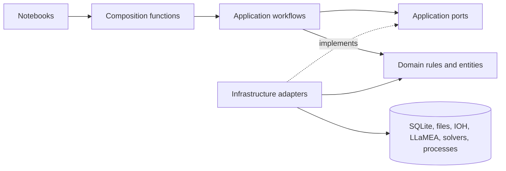

# System Architecture

`AAD_LLM` uses a practical hexagonal architecture: application use cases coordinate
work through ports, domain modules own scientific rules, and infrastructure adapters
perform database, filesystem, process, and third-party-library work. It is not a
strictly pure DDD model.

## Dependency direction

```mermaid
flowchart LR
    Entry[Notebooks] --> Bootstrap[Composition functions]
    Bootstrap --> App[Application workflows]
    App --> Ports[Application ports]
    App --> Domain[Domain rules and entities]
    Infra[Infrastructure adapters] -. implements .-> Ports
    Infra --> Domain
    Infra --> External[(SQLite, files, IOH, LLaMEA, solvers, processes)]
```

The dependency rule for new core code is inward: domain code depends only on domain
and standard-library concepts; application code depends on domain and application
ports; infrastructure depends inward on those contracts and outward on external
libraries. Notebook/bootstrap code constructs concrete adapters. The dotted adapter
relationship is runtime wiring, not an import from a port to its implementation.
Shared BBOB metadata lives in `shared/domain/`; shared SQLite and generated-code
execution live in `shared/infra/`.

Database wiring is intentionally small: each bootstrap function creates one
`shared.infra.database.Database`, which owns the configured SQLAlchemy engine and
session factory, then passes that factory to the repositories it constructs. The
database adapter preserves SQLite WAL, foreign-key enforcement, busy timeout, and
normal synchronous mode. Repositories open and close short-lived sessions per
operation; application use cases receive repositories rather than a live SQLAlchemy
session. Synthesis workers create their own `Database` inside the worker process.

## Evolution context (`src/evolution/`)

- `application/campaign/` separates audit, task planning, and campaign dispatch.
  `application/synthesis/` groups the single-session and candidate-evaluation use cases.
- `application/interfaces/` owns abstract repository, configuration, execution, problem-factory,
  and dispatcher contracts. Worker functions remain module-level for process pickling.
- `domain/` owns experiment entities, enums, noise rules, and
  `AlgorithmScoringService` (objective-gap, fitness, and failure classification).
- `infra/` adapts SQLite/files, IOH BBOB problems, LLaMEA, candidate process execution,
  logging, and multiprocessing to application ports.

Candidate execution (running generated Python, timing, and capturing tracebacks) is
an application workflow implemented by an infrastructure executor. Scoring is a
domain rule shared by synthesis and benchmark evaluation. Use the application
candidate-evaluation service and executor port directly; the domain contains no
generated-code execution.

## Benchmarking context (`src/benchmarking/`)

- `application/evaluation/` separates workload discovery, per-condition trials,
  batch execution, and coverage auditing. `select_champions.py` owns ranking.
- `application/analysis/` loads datasets and writes reports. Notebooks call the
  domain reliability, ECDF, performance, and hypothesis engines directly.
- `domain/` owns benchmark-independent reliability, ECDF, performance, and statistical
  calculations.
- `infra/` owns SQLite candidate queries and benchmark state, champion JSON and trace
  IO, Markdown writing, code loading, IOH problem lifecycle/noise calibration, and
  CMA-ES/DE/PSO adapters.

The notebook composition functions wire concrete problem, execution, solver, and
code-reading adapters. Model-registry TOML loading is infrastructure work; the
domain's `ModelNames` formats names from supplied registry records. Both workflows
use the same shared BBOB function definition. Champion selection policy is
application-owned; repositories return candidate records and persist exports.

## Data and imports

Imports are explicit from the owning layer; compatibility shims are not maintained.
Configuration keys, notebook entry points,
champion JSON shape, traces, and existing experiment data are preserved; this refactor
does not regenerate benchmark results.
