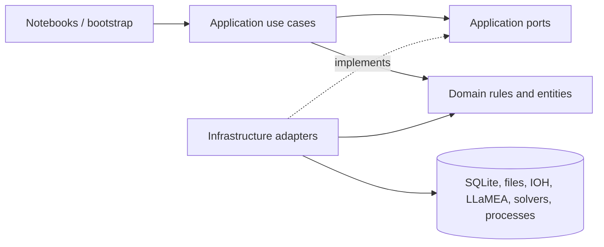

# System Architecture

`AAD_LLM` uses a practical hexagonal architecture: application use cases coordinate
work through ports, domain modules own scientific rules, and infrastructure adapters
perform database, filesystem, process, and third-party-library work. It is not a
strictly pure DDD model.

## Dependency direction

```mermaid
flowchart LR
    Entry[Notebooks / bootstrap] --> App[Application use cases]
    App --> Ports[Application ports]
    App --> Domain[Domain rules and entities]
    Infra[Infrastructure adapters] -. implements .-> Ports
    Infra --> Domain
    Infra --> External[(SQLite, files, IOH, LLaMEA, solvers, processes)]
```

The dependency rule for new core code is inward: domain code depends only on domain
and standard-library concepts; application code depends on domain and application
ports; infrastructure depends inward on those contracts and outward on external
libraries. Notebook/bootstrap code constructs concrete adapters. The dotted adapter
relationship is runtime wiring, not an import from a port to its implementation.

## Evolution context (`src/evolution/`)

- `application/` coordinates single synthesis and campaign use cases. Campaign
  orchestration receives problem-factory, task-dispatch, repository, engine, logger,
  and configuration interfaces. Worker functions remain module-level for process
  pickling.
- `application/interfaces/` owns repository, configuration, execution, problem
  factory, and dispatcher contracts. Synthesis configuration models are application
  data contracts, not infrastructure models.
- `domain/` owns experiment entities, enums, noise rules, and
  `AlgorithmScoringService` (objective-gap, fitness, and failure classification).
- `infra/` adapts SQLite/files, IOH BBOB problems, LLaMEA, candidate process execution,
  logging, and multiprocessing to application ports.

Candidate execution (running generated Python, timing, and capturing tracebacks) is
an application workflow implemented by an infrastructure executor. Scoring is a
domain rule shared by synthesis and benchmark evaluation. Use the application
candidate-evaluation service and executor port directly; the domain contains no
generated-code execution.

## Benchmarking context (`src/benchmarking/`)

- `application/` owns evaluation/audit orchestration, champion ranking, and analytical
  report coordination.
- `domain/` owns benchmark-independent reliability, ECDF, performance, and statistical
  calculations.
- `infra/` owns SQLite candidate queries and benchmark state, champion JSON and trace
  IO, Markdown writing, code loading, IOH problem lifecycle/noise calibration, and
  CMA-ES/DE/PSO adapters.

`EvaluationService` is wired with concrete problem, execution, solver, and code-reading
adapters by the notebook/bootstrap layer. Champion selection policy is
application-owned; repositories return candidate records and persist exports.

## Data and imports

Imports are explicit from the owning layer; package-level aliases and compatibility
shims are intentionally not maintained. Configuration keys, notebook entry points,
champion JSON shape, traces, and existing experiment data are preserved; this refactor
does not regenerate benchmark results.
