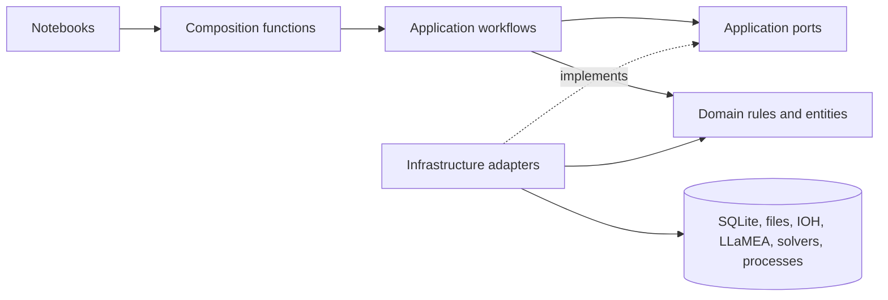

# System Architecture

`AAD_LLM` uses a practical hexagonal architecture: application use cases coordinate
work through ports, domain modules own scientific rules, and infrastructure adapters
perform database, filesystem, process, and third-party-library work. It is not a
strictly pure DDD model.

## Context map and ownership

This is a modular monolith with two workflow contexts, not independent services.

```text
Notebook dashboards / figures / exports
                  ↓ composition in bootstrap
        Evolution                 Benchmarking
    synthesis + campaign       selection + evaluation + analysis
                  ↓                    ↓
       Shared scientific rules and runtime infrastructure
```

Evolution owns prompts, generation modes, experiment/iteration semantics, fitness
penalties, and campaign coverage. Benchmarking owns champion ranking, trial
protocols, condition validity, benchmark coverage, reliability, and transfer studies.
Audit and analysis are workflows, not a third bounded context. Persistence and
candidate runtime are supporting infrastructure, not business contexts.

Shared code must not depend on either context. Neither context's domain or
application imports the other context. Bootstrap may compose both. Benchmarking's
read-only SQLite adapters deliberately consume synthesis-owned table projections;
they must not write synthesis state or invoke synthesis workflows. The ORM schema
stays in shared infrastructure for this single-database application; evolution owns
its synthesis-table meaning and writes. Benchmark traces/provenance belong to
benchmarking. No database/schema migration is required.

## Dependency direction


```mermaid
flowchart LR
    Entry[Notebooks] --> Bootstrap[Composition functions]
    Bootstrap --> App[Application workflows]
    App --> Ports[Application ports]
    App --> Domain[Domain rules and entities]
    Infra[Infrastructure adapters] -. implements .-> Ports
    Infra --> Domain
    Infra --> External[(SQLite, files, IOH, LLaMEA, solvers, processes)]
```

The dependency rule for new core code is inward: domain code depends only on domain
and standard-library concepts; application code depends on domain and application
ports; infrastructure depends inward on those contracts and outward on external
libraries. Notebook/bootstrap code constructs concrete adapters. The dotted adapter
relationship is runtime wiring, not an import from a port to its implementation.
Shared BBOB metadata, objective-problem capabilities, noise mathematics, and the
objective-gap function live in `shared/domain/`. IOH problem construction,
calibration/lifecycle, SQLite, and guarded candidate execution live in
`shared/infra/`. Synthesis mode and `ProblemProfile` are not problem-adapter
capabilities: evolution constructs the profile and passes the session mode.

Database wiring is intentionally small: each bootstrap function creates one
`shared.infra.database.Database`, which owns the configured SQLAlchemy engine and
session factory, then passes that factory to the repositories it constructs. The
database adapter preserves SQLite WAL, foreign-key enforcement, busy timeout, and
normal synchronous mode. Repositories open and close short-lived sessions per
operation; application use cases receive repositories rather than a live SQLAlchemy
session. Synthesis workers create their own `Database` inside the worker process.

## Evolution context (`src/evolution/`)

- `application/campaign/` separates audit, task planning, and campaign dispatch.
  `application/synthesis/` groups the single-session and candidate-evaluation use cases.
- `application/interfaces/` owns synthesis repository, engine, logging, code-store,
  and dispatcher contracts. Execution and problem-factory contracts are shared.
  Worker functions remain module-level for process pickling.
- `domain/` owns experiment entities, synthesis enums, and `AlgorithmScoringService`
  (fitness and failure classification using the shared objective gap).
- `infra/` adapts SQLite/files, LLaMEA, logging, synthesis telemetry, and multiprocessing.

Candidate execution (running generated Python, timing, and capturing tracebacks) is
an application workflow implemented by an infrastructure executor. Scoring is a
domain policy specific to synthesis; both workflows use the shared objective-gap
calculation without sharing fitness penalties. Use the application
candidate-evaluation service and executor port directly; the domain contains no
generated-code execution.

## Benchmarking context (`src/benchmarking/`)

- `application/evaluation/` separates workload discovery, per-condition trials,
  batch execution, and coverage auditing. `select_champions.py` owns ranking.
- `application/analysis/` loads datasets and writes reports. Notebooks call the
  domain reliability, ECDF, performance, and hypothesis engines directly.
- `domain/` owns benchmark-independent reliability, ECDF, performance, and statistical
  calculations.
- `infra/` owns SQLite candidate queries and benchmark state, champion JSON and trace
  IO, Markdown writing, code loading, and CMA-ES/DE/PSO adapters. IOH problem
  lifecycle/noise calibration and candidate execution are shared infrastructure.

The notebook composition functions wire concrete problem, execution, solver, and
code-reading adapters. Model-registry TOML loading is infrastructure work; the
domain's `ModelNames` formats names from supplied registry records. Both workflows
use the same shared BBOB function definition. Champion selection policy is
application-owned; repositories return candidate records and persist exports.

## Audit and analysis boundaries

`bootstrap.audit.build_audit_service()` translates synthesis configuration into
plain condition specifications. The benchmark audit reports missing champions
separately from executable condition completion and reuses the pure status policy
used by workload discovery and trial resumption. Stale schema/hash results expose
recorded counts but contribute zero reusable trials. Native, noise robustness,
implicit/explicit origins, and cross-function conditions never substitute for one
another. Baselines do not require a synthesis champion.

Audit returns numeric IDs, counts, reasons, and statuses. Notebook 04 owns icons,
labels, heatmaps, CSV exports, and the Markdown dashboard. Analysis input snapshots
contain data and pure naming metadata, not live repositories or engine services.
Scientific engines are called directly; Plotly, PNG export, and figure caching live
under `notebooks/analysis/plotting/`. Terminal trial completion and available
convergence traces remain distinct: missing traces are not fabricated.

Architecture tests enforce layer direction, context independence, shared-foundation
independence, and the absence of backend presentation dependencies.

## Data and imports

Imports are explicit from the owning layer; compatibility shims are not maintained.
Configuration keys, notebook entry points,
champion JSON shape, traces, and existing experiment data are preserved; this refactor
does not regenerate benchmark results.

Historical synthesis pickle checkpoints use an infrastructure reader that translates
the six relocated scientific/runtime type module names during deserialization.
It preserves pickle state and normal rehydration hooks without restoring obsolete
Python modules or rewriting archives. As before, only trusted local pickle archives
may be loaded; this is not a security sandbox for checkpoint files.
