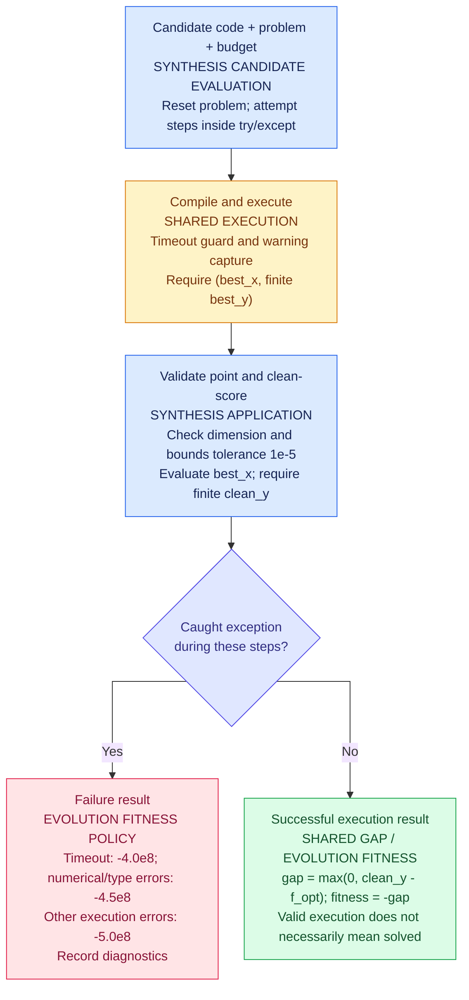
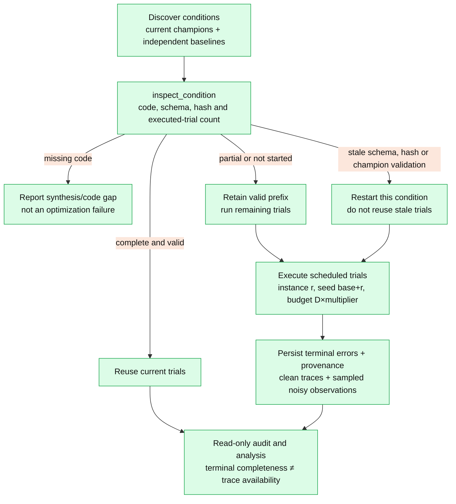

# Evaluation protocol

[Documentation map](README.md) · [Project README](../README.md)

Diagrams describe current execution behavior, not historical campaign findings.
Stored experiment records and provenance—not today's defaults—identify past settings.

## Synthesis candidate scoring



The decision summarizes the enclosing `try/except`: an exception skips any remaining
steps and goes directly to the failure result.

The diagram is specifically the synthesis workflow. Benchmark trials use the shared
executor, validate the returned point, and clean-score it, but do not use
synthesis fitness penalties.
A finite execution result is not necessarily a solved optimization problem.

## Benchmark readiness, resumption and analysis

<!-- Diagram source is rendered directly by GitHub. -->


This is normal resumption with `force_rerun=false`. Force rerun deliberately
bypasses cache reuse. Historical skipped tails are excluded from reusable trials;
confirmed execution failures remain observations.
Older champion results without the current returned-point validation marker are
stale; classical baseline results remain reusable.

## Native and secondary studies

| Study | Champion / target | Role and storage |
| --- | --- | --- |
| Native | Champion's original function and dimension. | Primary comparison; `results/ioh_traces/`. |
| Noise robustness | Freeze a clean explicit champion; add noise on its original function. | Secondary robustness; native trace layout and matching code hashes. |
| Cross-function transfer | Freeze clean explicit baseline-strategy champions; change function, not dimension. | Opt-in; off-diagonal `results/cross_function_traces/`, native diagonal and baseline reuse. |

No champion is selected using transfer outcomes. Missing/incomplete conditions
are not failures and are excluded from aggregates.

## Measurements and execution safeguards

| Item | Implemented meaning |
| --- | --- |
| Return contract | `(best_x, finite best_y)`; scalar-only returns are rejected. |
| Terminal gap | `max(0, clean_objective(returned_x) - f_opt)`. |
| Benchmark champion return | Require finite, correctly dimensioned coordinates within the search domain before clean scoring. |
| Trace attainment | Best clean queried point; not proof that this point was returned. |
| Noisy observations | Separately sample values actually returned to the optimizer at up to 64 logarithmic checkpoints plus its final query; IOH traces remain clean. |
| Primary / secondary targets | `1e-8` / `1e-2`; baseline strategy for headline model comparisons. |
| Uncertainty | Wilson condition intervals; deterministic condition-cluster aggregate bootstrap. |
| Budget | Benchmark attaches `set_budget`; excess queries warn and return the last value. Synthesis does not itself attach that cap. |
| Timeout | Per-candidate `func_timeout`; session process workers are not a per-candidate security sandbox. |
| Default benchmark trials | 20; instance `r`, seed `42+r`, budget `D×10000`, timeout 30 seconds. |

Defaults come from [benchmark configuration](../configs/benchmark.toml).
Synthesis uses instance 1: benchmark trials are not exclusively held-out instances.
Repeated champion trials do not measure repeated LLM discovery.
[Analysis notebooks](../notebooks/analysis/README.md) own PNG-only figures and exports.

<details>
<summary>Exact validation, scoring, noise, configuration switches and output paths</summary>

## Candidate execution and return contract

Generated optimizers must return `(best_x, best_y)`. Scalar-only returns are rejected.
The shared executor compiles the candidate, runs it with `func_timeout`, captures
warnings, converts the returned coordinates to a NumPy array, and requires a finite
scalar `best_y`. Synthesis candidate evaluation checks the returned dimension and
bounds and evaluates the point on the clean objective. Benchmark champion trials
also check dimension, finite coordinates and bounds before clean scoring. The
bounds check uses a tolerance of `1e-5`.

Execution is guarded, but this is not a security sandbox. Synthesis campaigns use
process-pool workers for sessions; individual candidate timeouts use
`func_timeout`, not a newly spawned, forcibly terminated process per candidate.
A timeout does not establish that the candidate was otherwise numerically correct.

Implementation:
[executor](../src/shared/infra/execution/executor.py),
[candidate evaluation](../src/evolution/application/synthesis/evaluate_candidate.py),
[worker](../src/evolution/infra/concurrency/worker.py).

## Clean solution scoring

For minimization, both contexts use the same objective gap:

```text
gap = max(0, clean_objective(best_x) - f_opt)
successful synthesis fitness = -gap
```

The returned `best_y` is validated, but it is not the synthesis selection score.
For noisy search it may be a noisy observation. Clean re-evaluation uses a separate,
unlogged IOH problem and does not consume the search problem's evaluation count.
The optimum depends on the BBOB function, dimension and instance.

Synthesis failure scores are defined in
[AlgorithmScoringService](../src/evolution/domain/services/algorithm_scoring.py):

| Category | Fitness |
| --- | --- |
| Timeout | `-4.0e8` |
| Selected numerical/type errors | `-4.5e8` |
| Other execution errors | `-5.0e8` |

Candidate evaluation assigns the category, records diagnostics and code context,
and tracks consecutive failures. Benchmark execution failures are recorded as
infinite terminal errors, not these synthesis fitness penalties.

## Objective budget

Candidates receive a budget and are expected to track every objective call,
including the initial query and repeated queries to the same point. Actual
evaluation counts come from the problem adapter, not the candidate's counter.

When a budget is attached with `set_budget`, the BBOB adapter stops making new
IOH evaluations at the limit: further calls warn and return the last observed
value. This is not equivalent to raising an exception on every excess interface
call. The executor also has an overrun-warning check when the supplied callable
exposes an evaluation count. Do not describe these guards as a universal hard
limit on the number of Python invocations.

Benchmark trials explicitly attach a budget to the problem. The current synthesis
candidate-evaluation workflow passes a budget to the optimizer but does not itself
call `set_budget`; a hard adapter limit must not be assumed for every synthesis run.

See [BBOB adapter](../src/shared/infra/problems/bbob.py) and
[current synthesis configuration](../configs/synthesis.toml).

## Noise

[Shared noise strategies](../src/shared/domain/noise.py) implement:

- No noise: the clean value.
- Heteroscedastic Gaussian noise: standard deviation
  `noise_std * abs(clean_value - f_opt)`.
- Homoscedastic additive noise: standard deviation
  `noise_std * landscape_scale`, with scale calibrated from 200 uniform clean
  samples by default.
- AWGN: additive zero-mean Gaussian noise with standard deviation `noise_std`.

IOH creation, calibration evaluations and resets belong to the shared BBOB adapter.
Noise strategy selection and magnitude are configuration-driven.

## Independent benchmarking and reliability

[Benchmark configuration](../configs/benchmark.toml) currently requests 20 trials
per condition, budget `dimension * 10000`, and a 30-second execution timeout.
Trial `r` uses instance `r` and seed `random_seed + r`; the default base seed is 42.
Synthesis uses instance 1, so the benchmark is not exclusively held-out-instance
testing. Repeated champion trials are not independent synthesis replicates.

Native terminal reliability scores the returned point using the clean objective.
Convergence traces describe the best clean point queried during search; these
answer a different question. A target reached in a trace does not prove the
optimizer returned that point.

IOH logging is attached to the underlying clean problem: its `.dat` traces
contain clean query values, not noisy observations delivered to the optimizer.
New noisy trials also store bounded samples of actual observed values in
`provenance.json` under `observed_objectives`. They are diagnostic samples, not
a complete per-query noisy trace. The `observation_trace_points` benchmark
setting controls their maximum count. Existing trials cannot gain these values
retroactively. Older champion results without benchmark returned-point
validation are flagged for reevaluation; baseline results remain reusable.
Previously exported CSVs and figures are not automatically rewritten and should
not be described as results under the new validation policy until refreshed.

The headline model comparison uses the baseline prompt strategy and fixed gap
threshold `1e-8`; `1e-2` is secondary. These are declared precision targets,
not machine epsilon. Condition rates use 95% Wilson intervals; aggregate intervals
bootstrap complete conditions. Defaults are 1,000 bootstrap resamples and a fixed
seed. Missing or incomplete conditions are excluded from aggregate estimates;
confirmed execution failures remain observations. Historical unexecuted skipped
tails are not treated as failures.

Fixed-target attainment uses observed evaluation checkpoints without inventing
intermediate target hits. Adaptive-target ECDF/AUC analysis remains exploratory.
Notebooks own Plotly styling and PNG exports; domain engines own calculations.

See [analysis notebooks](../notebooks/analysis/README.md) for presentation and
exports. No empirical winner, percentage or campaign total should be inferred
from current configuration alone.

## Native versus secondary studies

Native evaluation tests the champion on its original function and dimension.
Noise robustness and cross-function generalization are separate secondary
questions; neither enters the native champion ranking.

## Noise robustness

`service.run_noise_robustness()` freezes each clean explicit champion and tests
added noise on its original function and dimension. The existing
`cross_eval_clean_champions` configuration key enables/disables this workflow.
Historical storage remains `results/ioh_traces/`; it is not moved or deleted.
Notebook 07 requires matching clean-champion code hashes across noise levels and
excludes separately synthesized noisy and implicit champions from these overlays.
Noise-robustness ECDF exports have been removed; adaptive
targets remain exploratory elsewhere. Figures use `results/figures/05_noise_robustness/`.

## Cross-function generalization

Enable `benchmarking.cross_function_enabled` in `configs/benchmark.toml`, then set
`RUN_CROSS_FUNCTION = True` in notebook 03's separate campaign cell, or explicitly
call `service.run_cross_function_evaluations()`.

Only clean, explicit, baseline-strategy champions enter this workflow. Their code
is unchanged, their dimension is unchanged, and the clean target functions default
to f1, f8, f11, f15 and f21. Diagonal source–target cells provide native-function
references, reused from the ordinary native trace folders when current. Off-diagonal
cells measure transfer, not a replacement native ranking.
No champion is selected or tuned using transfer results. Classical CMA-ES, DE and
PSO results are evaluated once per target condition in their ordinary trace
folders and reused across source-function comparisons.

Off-diagonal transfer results live separately in `results/cross_function_traces/`, grouped by
source function, dimension, target noise, target function, model/strategy and code
hash. Provenance records both source and target identities, champion experiment
and iteration, code hash, instances, seeds, budgets and returned-point errors.
Resumption requires the current code hash and error schema. Noise/native folders
and transfer folders cannot overwrite each other.

Notebook 07 exports returned-point success rate versus noise, with separate dimension panels and 95% condition-bootstrap intervals only (no convergence or ECDF exports). Complete available functions receive equal weight; exported counts expose unequal coverage. Missing conditions are not failures. No success-rate figure is exported when only clean trials exist. Cross-function figure exports have been removed; the opt-in evaluation backend and existing transfer records remain available.

## Interpretation and historical trials

Notebook 03 ends with a read-only outcome summary for current native champions
and baselines. It shows owning LLM and experiment ID, executed/valid/expected
trial counts, failed trials, fixed-target success rates, median errors and the
best baseline median error for the same condition. More than half the expected
trials failing is labelled `mostly_failed`; all failing is `all_failed`.
Only complete, current champion conditions in these categories are suggested
for synthesis review. Missing/stale results and historical skipped tails require
benchmark completion first. Large finite errors above the secondary target are
performance-review flags, not automatic rerun requests. The summary neither
launches experiments nor writes or deletes result files.

All workflows retain the existing dimension-scaled budgets, timeout, trial count,
paired instance IDs 1–20 and seeds derived from the configured base seed. Because
the synthesis instance is included, this is not exclusively held-out-instance
evaluation. Baselines are general-purpose references; generated champions were
selected for their source problem. Poor transfer can therefore demonstrate
specialization without contradicting strong native performance.

Every scheduled trial now executes even after earlier failures. Historical
infinite-error tails with zero runtime and zero evaluations from the old
two-failure shortcut are unexecuted, not empirical failures. Readiness and terminal
analysis exclude those tails, and subsequent evaluation resumes them while keeping
the genuine earlier trials. No existing results are rewritten by analysis alone.

</details>
