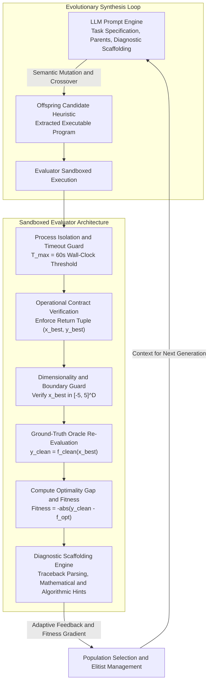
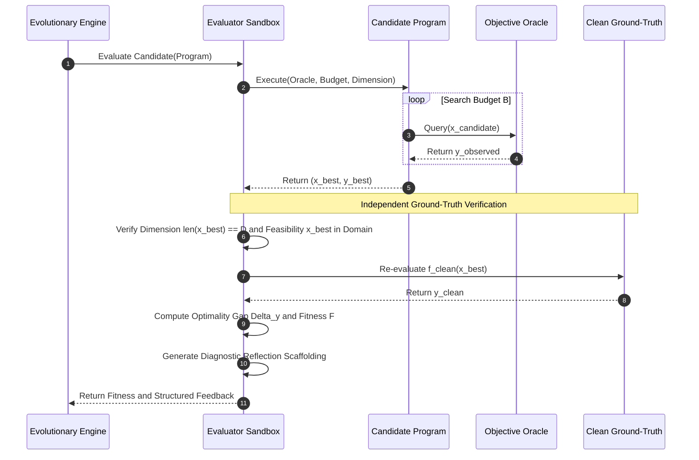

# Methodology: Automated Algorithm Discovery via Large Language Model Evolutionary Synthesis

This chapter presents the theoretical and mathematical methodology governing the **Automated Algorithm Discovery (AAD)** framework. It details the evolutionary program synthesis paradigm, the architectural rationale and mathematical design of the **Evaluator**, the rationale behind ground-truth re-evaluation, the prompt scaffolding reflection engine, and the post-hoc statistical validation protocol.

---

## 1. Theoretical Foundations of Evolutionary Algorithm Discovery

### 1.1 Automated Algorithm Discovery as Program-Space Meta-Optimization
Traditional numerical optimization heuristics (e.g., Genetic Algorithms, Particle Swarm Optimization, CMA-ES) are human-designed rules derived from mathematical intuition and empirical benchmarking. Automated Algorithm Discovery (AAD) reformulates heuristic design as an **evolutionary meta-optimization problem over the infinite, discrete space of executable programs**:

$$\mathcal{H}^* = \arg\max_{\mathcal{H} \in \mathbb{P}} \mathbb{E}_{f \sim \mathcal{D}_{\text{bench}}} \left[ \mathcal{U}\left(\mathcal{H}, f, B, D\right) \right]$$

where:
* $\mathbb{P}$ denotes the space of syntactically valid executable programs implementing a black-box numerical optimizer.
* $\mathcal{D}_{\text{bench}}$ represents the underlying distribution of continuous black-box benchmark optimization landscapes (the BBOB problem taxonomy).
* $B \in \mathbb{N}^+$ and $D \in \mathbb{N}^+$ denote the evaluation budget (maximum function calls) and search space dimensionality, respectively.
* $\mathcal{U}: \mathbb{P} \times \mathcal{D}_{\text{bench}} \times \mathbb{N}^+ \times \mathbb{N}^+ \to \mathbb{R}$ is the utility (fitness) functional quantifying the optimizer's empirical convergence and solution quality.

### 1.2 The $(\mu + \lambda)$ LLM-Driven Evolutionary Mechanism
Instead of primitive string mutations or random Abstract Syntax Tree (AST) crossover operations—which overwhelmingly generate syntactically broken or semantically degenerate code—we utilize a **Large Language Model (LLM) as a context-aware, semantic genetic variation operator**:

1. **Population Structure**: At generation $t$, the population $\mathcal{P}_t = \{\mathcal{S}_1, \dots, \mathcal{S}_\mu\}$ maintains $\mu$ candidate optimization heuristics. Each individual is defined as a tuple:
   $$\mathcal{S}_i = \langle \mathcal{C}_i, \mathcal{F}_i, \mathcal{M}_i, \mathcal{E}_i \rangle$$
   where $\mathcal{C}_i$ is the executable algorithmic representation, $\mathcal{F}_i \in \mathbb{R}$ is the scalar fitness, $\mathcal{M}_i$ is quantitative execution metadata, and $\mathcal{E}_i$ is rich qualitative execution feedback.
2. **Parent Selection**: High-performing individuals are selected based on fitness $\mathcal{F}_i$ under elitist rank selection to construct prompt exemplars.
3. **Semantic Variation Operators**:
   - **Semantic Mutation (Local Refinement)**: An individual $\mathcal{S}_{\text{parent}}$ along with its empirical performance and diagnostic execution feedback is provided to the LLM. The LLM acts as an intelligent programmer, reasoning over the failure modes of the algorithm and generating an improved offspring $\mathcal{S}_{\text{offspring}}$.
   - **Semantic Crossover (Conceptual Recombination)**: Two distinct parents exhibiting complementary search behaviors (e.g., an aggressive exploratory algorithm and a fine-grained local hill-climber) are presented in context. The LLM synthesizes a unified hybrid mechanism.
4. **Sandboxed Evaluation & $(\mu + \lambda)$ Elitism**: $\lambda$ offspring algorithms are independently evaluated. Offspring and parents are pooled together, and the top $\mu$ algorithms survive into $\mathcal{P}_{t+1}$.

---

## 2. The Evaluator Architecture & Design Rationale



### 2.1 The Black-Box Operational Contract
To ensure realistic evaluation and prevent algorithms from cheating, candidate heuristics operate under a strict **black-box contract**:
$$\text{Candidate Heuristic: } \mathcal{H}\left(f_{\text{blackbox}}, B, D\right) \longrightarrow \left(\mathbf{x}^*, y^*\right)$$

* The heuristic is provided with an opaque function handle $f_{\text{blackbox}}: \mathbb{R}^D \to \mathbb{R}$, an evaluation budget $B$, and dimensionality $D$.
* The heuristic has **zero access** to analytical gradients, optimal coordinates $\mathbf{x}_{\text{opt}}$, optimal function values $f^* = f(\mathbf{x}_{\text{opt}})$, or internal landscape properties.
* The heuristic terminates when the evaluation budget $B$ is exhausted and returns its best-discovered coordinate vector $\mathbf{x}^* \in \mathbb{R}^D$ alongside its observed scalar value $y^* \in \mathbb{R}$.

### 2.2 Why We Override Self-Reported Fitness: Ground-Truth Re-Evaluation
A critical architectural principle of our Evaluator is the **mandatory re-evaluation of candidate coordinates on the clean ground-truth objective**. 

$$\text{Recorded Performance: } y_{\text{clean}} = f_{\text{clean}}(\mathbf{x}^*)$$

#### Theoretical Justification:
1. **The Anti-Hallucination Oracle**: An optimization heuristic may experience internal numerical overflows, state corruptions, or stochastic fluctuations. If an algorithm self-reports an artificially low fitness $y^* = 10^{-15}$ due to a software bug or a lucky noise draw, accepting $y^*$ would corrupt the evolutionary search, causing the LLM to reinforce invalid mathematical mechanisms.
2. **True Solution Quality Verification**: The true measure of an optimization algorithm is the actual geometric position $\mathbf{x}^*$ it identifies in the search space. By passing $\mathbf{x}^*$ to the exact un-corrupted objective function $f_{\text{clean}}$, the Evaluator computes an **unbiased, mathematically rigorous measure of optimization capability**.

---

## 3. Mathematical Formulations & Evaluation Metrics

The Evaluator measures algorithmic efficacy across two primary domains: **Objective Space Performance** (function value precision) and **Decision Space Proximity** (geometric coordinate accuracy).



### 3.1 Primary Mathematical Metrics

| Metric / Dimension | Mathematical Formulation | Theoretical & Scientific Purpose |
| :--- | :--- | :--- |
| **Ground-Truth Optimality Gap** | $\Delta y = \vert f_{\text{clean}}(\mathbf{x}^*) - f^* \vert$ | The absolute deviation between the clean objective value at coordinate $\mathbf{x}^*$ and the global analytical minimum $f^* = f(\mathbf{x}_{\text{opt}})$. |
| **LLaMEA Fitness Score** | $\mathcal{F} = -\Delta y = -\vert f_{\text{clean}}(\mathbf{x}^*) - f^* \vert$ | Negated optimality gap. Because evolutionary engines maximize fitness, driving $\mathcal{F} \to 0.0$ directly minimizes the optimality gap. |
| **Log-Scaled Optimality Gap** | $\mathcal{L} = \log_{10}\left(\max\left(\Delta y, \tau_{\text{conv}}\right)\right)$ | Logarithmic transformation ($\tau_{\text{conv}} = 10^{-8}$) enabling linear comparison of exponential convergence behaviors spanning multiple orders of magnitude. |
| **Relative Optimality Gap** | $\epsilon_{\text{rel}} = \begin{cases} \frac{\Delta y}{\vert f^* \vert} & \text{if } f^* \neq 0 \\ \Delta y & \text{if } f^* = 0 \end{cases}$ | Scale-invariant error normalized against the magnitude of the theoretical global minimum. |
| **Decision Space Euclidean Distance** | $d_2(\mathbf{x}^*, \mathbf{x}_{\text{opt}}) = \Vert \mathbf{x}^* - \mathbf{x}_{\text{opt}} \Vert_2 = \sqrt{\sum_{i=1}^D (x_i^* - x_{\text{opt}, i})^2}$ | Physical Euclidean distance in search space $\mathbb{R}^D$ between discovered point $\mathbf{x}^*$ and the true global optimum coordinate $\mathbf{x}_{\text{opt}}$. |
| **Target Precision Convergence Hit** | $\mathbb{I}_{\text{conv}} = \begin{cases} 1 & \text{if } \Delta y \le 10^{-8} \\ 0 & \text{otherwise} \end{cases}$ | Strict binary indicator signifying whether the heuristic successfully solved the problem within standard numerical machine precision ($10^{-8}$). |

---

## 4. The Tiered Penalty Hierarchy

When synthesizing programs dynamically, candidate algorithms frequently encounter execution failures. Rather than assigning a flat, uniform failure value (e.g., $-\infty$ or a single arbitrary constant), our Evaluator implements a **graduated, tiered penalty hierarchy**:

$$\mathcal{F}_{\text{failure}} = \begin{cases} -1.0 \times 10^7 & \text{if Execution Timeout } (t_{\text{runtime}} > T_{\text{max}}) \\ -1.0 \times 10^8 & \text{if Runtime Mathematical or Shape Exception} \\ -1.0 \times 10^9 & \text{if Syntax, Compilation, or AST Parsing Error} \end{cases}$$

### Theoretical & Evolutionary Rationale:
1. **Preservation of Evolutionary Selection Gradients**:
   - A syntax error indicates a program that cannot even be parsed—it represents total informational failure ($\mathcal{F} = -10^9$).
   - A runtime error (e.g., matrix dimension mismatch or division by zero) represents a program that successfully compiled and possessed valid conceptual logic, but failed at edge-case boundary conditions ($\mathcal{F} = -10^8$).
   - A timeout ($T_{\text{max}} = 60.0\text{s}$) represents a program that was syntactically and mathematically correct, but exhibited inefficient time complexity ($O(N^2)$ or slow loops) ($\mathcal{F} = -10^7$).
2. **Directional Selection Pressure**: By establishing that $\mathcal{F}_{\text{timeout}} > \mathcal{F}_{\text{runtime}} > \mathcal{F}_{\text{syntax}}$, the evolutionary process maintains a clear mathematical slope: an inefficient but working algorithm is naturally preferred over a crashing algorithm, which in turn is preferred over an uncompilable script.

---

## 5. Diagnostic Prompt Scaffolding (Semantic Reflection Engine)

A central innovation in LLM-driven algorithm discovery is **Reflexion in Program Space**. When an algorithm fails or underperforms, raw numerical fitness alone provides insufficient guidance for code mutation. The Evaluator constructs structured **Diagnostic Prompt Scaffolding** that translates empirical execution traces into targeted natural language and code pointers.

### 5.1 Scaffolding Channels & Rationale

```
┌─────────────────────────────────────────────────────────────────────────────────────────────┐
│                           EVALUATOR DIAGNOSTIC SCAFFOLDING CHANNELS                         │
├──────────────────────────────┬──────────────────────────────────────────────────────────────┤
│ Scaffolding Channel          │ Semantic Feedback Injected into LLM Context                  │
├──────────────────────────────┼──────────────────────────────────────────────────────────────┤
│ 1. Successful Optimization   │ • Quantitative clean gap Δy and Euclidean distance d₂        │
│                              │ • Intercepted runtime mathematical warnings                  │
│                              │ • Guidance on accelerating convergence exploitation          │
├──────────────────────────────┼──────────────────────────────────────────────────────────────┤
│ 2. Syntax & Compilation      │ • Exact parsing traceback and compiler error description     │
│                              │ • Isolated code snippet with line pointer (-> line X: ...)   │
├──────────────────────────────┼──────────────────────────────────────────────────────────────┤
│ 3. Dimensionality & Bounds   │ • Dimension mismatch alerts (e.g., matrix degeneration)      │
│                              │ • Domain boundary clipping instructions (x ∈ [-5, 5]^D)      │
│                              │ • Numerical stability hints (e.g. matrix condition numbers)  │
├──────────────────────────────┼──────────────────────────────────────────────────────────────┤
│ 4. Computational Complexity  │ • Execution timeout notification (> 60.0s)                  │
│                              │ • Vectorization suggestions and nested loop removal advice   │
└──────────────────────────────┴──────────────────────────────────────────────────────────────┘
```

### 5.2 Mechanistic Breakdown of Scaffolding Channels
1. **Contextual Traceback Parsing**:
   - Rather than returning raw, unformatted system tracebacks that consume excessive prompt context, the Evaluator parses the failure stack, extracts the exact offending lines from the candidate code, and highlights them with directional line pointers (`-> line 42: ...`).
2. **Mathematical Edge-Case Scaffolding**:
   - Identifies numerical stability failures (e.g., negative values inside square roots, singular covariance matrices during matrix inversion in low dimensions $D \in \{2, 3, 5\}$) and instructs the model to implement eigenvalue regularization or mathematical clipping.
3. **Boundary Infeasibility Scaffolding**:
   - When a candidate returns coordinates $\mathbf{x}^* \notin [-5.0, 5.0]^D$, the Evaluator alerts the model to incorporate domain boundary projections ($\text{clip}(\mathbf{x}, \mathbf{lb}, \mathbf{ub})$) to prevent wasted exploration outside the feasible domain.

## 6. Post-Hoc Empirical Benchmark Performance Aggregation

To evaluate discovered algorithms with scientific rigor, synthesized champion algorithms are subjected to independent, multi-run validation across multiple random seeds ($R = 15$) and benchmark problem instances ($I$):

### Empirical Cumulative Distribution Functions (ECDF) & AUC-ECDF
Algorithm convergence is evaluated across continuous function evaluation time $t \in [1, B_{\text{max}}]$ over a set of $N_{\text{targets}} = 51$ logarithmically spaced target precision levels $\Theta = \{10^{-8}, 10^{-7.8}, \dots, 10^{2}\}$:

$$\operatorname{ECDF}(t) = \frac{1}{|\Theta| \cdot R \cdot I} \sum_{\theta \in \Theta} \sum_{i=1}^I \sum_{r=1}^R \mathbb{I}\left(\Delta y_{i, r}(t) \le \theta\right)$$

The overall sample efficiency is summarized by the Area Under the ECDF curve (**AUC-ECDF**), integrated across logarithmic evaluation budget:

$$\text{AUC-ECDF} = \frac{1}{\log_{10}(B_{\text{max}})} \int_{1}^{B_{\text{max}}} \operatorname{ECDF}(t) \, d(\log_{10} t)$$
