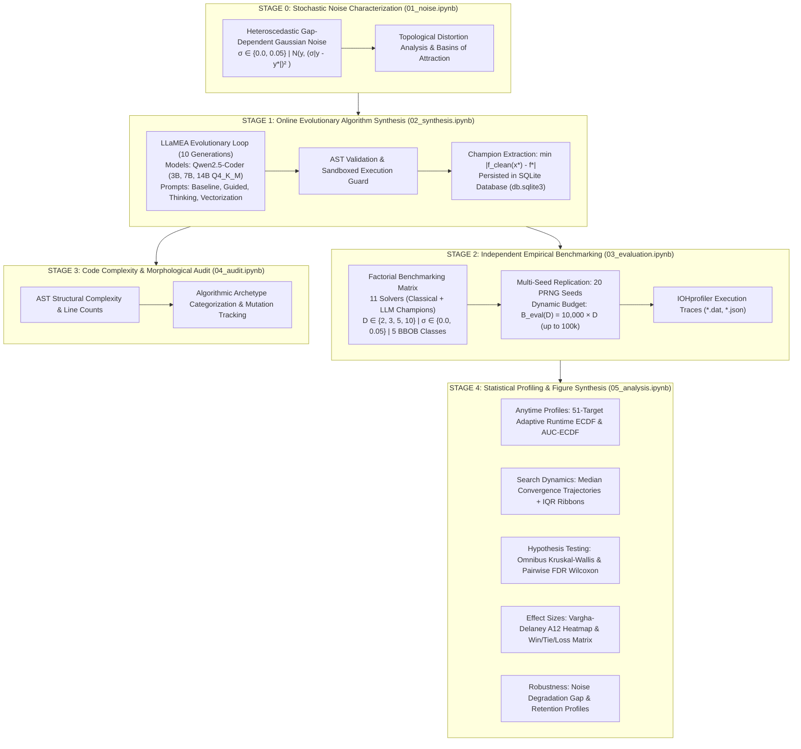

# Experimental Evaluation & Empirical Methodology: Thesis Chapter Blueprint

This document serves as the exhaustive **Experimental Evaluation Chapter Blueprint** for the Master's Thesis: *"Automated Algorithm Design for Continuous Black-Box Optimization via Large Language Models under Deterministic and Noisy Regimes"*. It details the entire experimental methodology, the exact configuration parameters, the multi-stage pipeline, in-depth algorithmic synthesis mechanics, prompt templates, mathematical metric formulations, and a complete storyboard mapping of all thesis figures to research questions.

---

## 1. Chapter Scope & Core Research Questions

The thesis empirical framework is centered on three **Primary Overarching Research Questions (Primary RQs)**, operationalized through three **Empirical Sub-Questions (Sub-RQs)**:

### 1.1 Primary Thesis Research Questions
* **RQ1 (Autonomous Synthesis & Competitiveness)**: Can localized Large Language Models autonomously synthesize continuous optimization heuristics that match or outperform established classical metaheuristics (CMA-ES, Differential Evolution, Particle Swarm Optimization) across continuous benchmark landscapes?
* **RQ2 (Noise Resilience in Autonomous Design)**: Can localized Large Language Models autonomously synthesize continuous optimization heuristics that are resilient to stochastic evaluation noise ($\sigma = 0.05$)?
* **RQ3 (Cross-Environment Robustness & Transfer)**: How does the cross-environment robustness and retention of noise-evolved heuristics compare against heuristics synthesized under clean deterministic baselines?

### 1.2 Operational Empirical Sub-Questions
* **Sub-RQ A (Model Parameter Capacity Scaling)**: How does the underlying LLM parameter scale ($3\text{B}$, $7\text{B}$, and $14\text{B}$ parameters in the `Qwen2.5-Coder` family) impact the mathematical sophistication, algorithmic novelty, and search efficiency of synthesized code?
* **Sub-RQ B (Prompt Scaffolding Ablation)**: How does the structural design of prompt scaffolding (Domain Guidance, Chain-of-Thought Reflection, Vectorization constraints) influence evolutionary trajectories compared to naive unguided baseline prompts?
* **Sub-RQ C (Synthesis-to-Evaluation Horizon & Dimension Scaling)**: Do candidate heuristics synthesized under low evaluation budgets ($B_{\text{synth}} = 1{,}000$ function calls) generalize when deployed across full-scale long-horizon benchmarking budgets ($B_{\text{eval}} = 10{,}000 \times D$ function calls, up to $100{,}000$ evaluations in $10\text{D}$)?

---


## 2. The Multi-Stage Experimental Architecture

To guarantee scientific validity, eliminate optimization overfitting, and enable deep morphological code analysis, the experimental system is organized into five decoupled stages:



---

## 3. Comprehensive Experimental Configurations & Parameters

### 3.1 Synthesis Configuration (`configs/synthesis.toml`)
Stage 1 operational parameters controlling the LLaMEA evolutionary synthesis engine:

| Parameter Category | Configuration Key | Assigned Value | Theoretical Rationale |
| :--- | :--- | :--- | :--- |
| **Search Space Matrix** | `matrix.problem_ids` | `[1, 8, 11, 15, 21]` | Spans separable ($f_1$), moderate conditioning ($f_8$), high conditioning ($f_{11}$), regular multi-modal ($f_{15}$), and deceptive ($f_{21}$). |
| | `matrix.dimensions` | `[2, 3, 5]` | Low-to-medium continuous dimensions for synthesis exploration. |
| | `matrix.noise_stds` | `[0.0, 0.05]` | Deterministic ground truth vs. stochastic heteroscedastic noise. |
| | `matrix.noise_model` | `"heteroscedastic"` | $\mathcal{N}(y, (\sigma \cdot \vert y - y^* \vert)^2)$, scaling perturbations proportionally to the optimality gap. |
| | `matrix.prompt_strategies` | `["baseline", "guided", "thinking", "vectorization"]` | Full prompt ablation matrix. |
| **Evolution Engine** | `evolution.iterations` | `10` Generations | Sufficient evolutionary horizon to observe mutation and structural code refinement. |
| | `evolution.budget` | `1,000` Evaluations ($B_{\text{synth}}$) | Low-budget regime forcing sample-efficient search mechanism discovery. |
| | `evolution.runs_per_config`| `1` Session | Deep exploration per configuration cell; champions extracted post-hoc. |
| **LLM Execution** | `llm.models` | `Qwen2.5-Coder-{3B,7B,14B}-Instruct` | Tests parameter capacity scaling on mathematical and algorithmic synthesis. |
| | `llm.quantization` | `Q4_K_M` (GGUF / Ollama) | Optimal trade-off between memory footprint, throughput, and reasoning fidelity. |
| | `llm.temperature` | $T = 0.7$ | Balances functional code exploitation with novel mutation exploration. |
| **Runtime & Safety** | `execution.auto_resume` | `true` | Fault-tolerant persistence in SQLite database (`db.sqlite3`). |
| | `execution.timeout` | `30.0` Seconds | Sandboxed execution timeout per candidate heuristic to prevent infinite loops. |

---

### 3.2 Post-Hoc Benchmarking Configuration (`configs/benchmark.toml`)
Stage 2 operational parameters controlling multi-seed empirical evaluation:

| Parameter Category | Configuration Key | Assigned Value | Methodological Purpose |
| :--- | :--- | :--- | :--- |
| **Statistical Replications** | `target_eval_runs` | `20` Independent Seeds | Guarantees non-parametric statistical power for Wilcoxon and Kruskal-Wallis tests. |
| **Evaluation Budget** | `budget_multiplier` | `10,000` Evals per Dimension | Implements standard BBOB scaling: $B_{\text{eval}}(D) = D \times 10{,}000$ (up to $100\text{k}$ in $10\text{D}$). |
| **Execution Safety** | `eval_timeout_seconds`| `30.0` Seconds per Run | Hard execution timeout guarding against algorithmic stalls. |
| | `budget_overrun_guard` | `True` (Hard Intercept) | Emits `[BUDGET OVERRUN]` warning and freezes evaluations at $B_{\text{eval}}(D)$. |
| **Classical Baselines** | `classical_baselines` | `["cmaes", "de", "pso"]` | Benchmark comparison against industry standard CMA-ES, Differential Evolution, and PSO. |
| **Dimensionality Suite** | `benchmark.dimensions`| `[2, 3, 5, 10]` | Evaluates synthesis generalization from low ($2\text{D}$) to high ($10\text{D}$) dimensions. |

---

## 4. In-Depth Algorithmic Synthesis Pipeline (Stage 1)

### 4.1 The LLaMEA Evolutionary Loop
The Automated Algorithm Design pipeline uses the **Large Language Model Evolutionary Algorithm (LLaMEA)** paradigm:

1. **Prompt Scaffolding Generation**: The system constructs an operational prompt specifying the black-box function contract:
   $$\mathbf{x}^* = \operatorname{solve}(f, \text{dim}, \text{budget}, \text{lower\_bound}, \text{upper\_bound})$$
2. **LLM Mutation / Generation**: The LLM emits executable Python source code satisfying the contract.
3. **AST Validation & Static Analysis**: The code is parsed into an Abstract Syntax Tree (AST) to verify:
   - No prohibited imports (e.g., `os`, `sys`, `socket`, `subprocess`).
   - Strict adherence to the `solve(...)` signature.
   - Syntactic correctness prior to execution.
4. **Sandboxed Evaluation on BBOB**: The candidate is executed on the target $(f_p, D, \sigma)$ condition within a budget of $B_{\text{synth}} = 1{,}000$ function calls.
5. **Fitness Assignment & Evolution**: The candidate fitness is assigned as the clean optimality gap $\vert f(\mathbf{x}^*) - f^* \vert$. The population evolves over 10 generations using elite preservation and mutation prompt scaffolding.
6. **SQLite Champion Extraction**: The highest-performing heuristic across the evolutionary trajectory is persisted in `db.sqlite3` as the condition champion.

```
┌─────────────────────────────────────────────────────────────────────────────────────────────┐
│                                 PROMPT STRATEGY ABLATION MATRIX                             │
├──────────────────────────────┬──────────────────────────────────────────────────────────────┤
│ Strategy Identifier          │ Theoretical Motivation & Scaffolding Mechanism               │
├──────────────────────────────┼──────────────────────────────────────────────────────────────┤
│ 1. Baseline                  │ • Unconstrained, open-ended metaheuristic prompt.            │
│                              │ • Measures the raw, unguided algorithmic prior of the LLM.   │
│ ├──────────────────────────────┼──────────────────────────────────────────────────────────────┤
│ 2. Guided                    │ • Infuses foundational continuous optimization heuristics.   │
│                              │ • Details 1/5th success rule step adaptation and momentum.   │
│                              │ • Encourages population diversity and orthogonal exploration.│
│ ├──────────────────────────────┼──────────────────────────────────────────────────────────────┤
│ 3. Thinking                  │ • Enforces structured Chain-of-Thought (CoT) reflection.     │
│                              │ • Mandates a pre-code markdown block analyzing parent failure│
│                              │   modes and landscape topology before emitting code.         │
│ ├──────────────────────────────┼──────────────────────────────────────────────────────────────┤
│ 4. Vectorization             │ • Imposes strict array-oriented mathematical constraints.    │
│                              │ • Enforces vectorized NumPy matrix operations over loops.    │
│                              │ • Optimizes evaluation throughput and parallel perturbations.│
└──────────────────────────────┴──────────────────────────────────────────────────────────────┘
```

---

## 5. Mathematical Formulations of Empirical Performance Metrics

### 5.1 The 51-Target Ladder & Runtime Empirical Cumulative Distribution Function (ECDF)

Performance is aggregated across problem instances and runs using the Runtime ECDF over a discretized ladder of **51 logarithmic precision target values** spanning the full dynamic range of optimization difficulty.

#### 5.1.1 Target Discretization Schemes: Deterministic vs. Noise-Aware Adaptive

1. **Standard Deterministic Target Ladder ($\sigma = 0.0$)**:
   In clean deterministic environments, the 51 targets span 10 orders of magnitude down to machine precision:
   $$\Theta_{\text{clean}} = \left\{ 10^{2.0 - 0.2 \cdot k} \;\middle|\; k \in \{0, 1, \dots, 50\} \right\} = \left\{ 10^{2.0}, 10^{1.8}, \dots, 10^{0.0}, \dots, 10^{-7.8}, 10^{-8.0} \right\}$$

2. **Noise-Aware Adaptive Target Ladder ($\sigma > 0.0$)**:
   Under stochastic evaluation noise ($\sigma = 0.05$), objective evaluations are subject to random perturbations $f_{\text{noisy}}(\mathbf{x}) = f(\mathbf{x}) + \mathcal{N}(0, \sigma^2 \cdot |f(\mathbf{x}) - f^*|)$. Consequently, true errors below $\Delta y \approx 10^{-3}$ fall below the stochastic noise floor where sampling variance dominates signal.
   
   Using static $10^{-8}$ targets under noise creates artificial **floor compression**: over 30 targets are fundamentally unreachable, permanently squishing all ECDF curves below $\approx 0.35$ regardless of search effectiveness.
   
   To maintain informative resolution, the target ladder adaptively spans the observable empirical error range:
   $$\Theta_{\text{adaptive}}(\sigma) = \left\{ 10^{\log_{10}(\tau_{\min}) + k \cdot \frac{\log_{10}(\tau_{\max}) - \log_{10}(\tau_{\min})}{50}} \;\middle|\; k \in \{0, 1, \dots, 50\} \right\}$$
   where $\tau_{\min} = \max(\operatorname{Percentile}_{5}(\text{final errors}), 10^{-3})$ and $\tau_{\max} = \min(\operatorname{Median}(\text{initial errors}), 10^4)$. This ensures all 51 targets actively discriminate solver performance across the reachable precision spectrum.

#### 5.1.2 Full-Distribution Multi-Run Aggregation Mechanics (No Cherry-Picking)

Let $T_r(f_p, \theta)$ denote the first-hitting evaluation count where run $r$ on problem $f_p$ first achieves an optimality gap $\Delta y \le \theta$:

$$T_r(f_p, \theta) = \min \left\{ t \in [1, B_{\text{eval}}(D)] \;\middle|\; \vert f_{\text{clean}}(\mathbf{x}_r(t)) - f^* \vert \le \theta \right\}$$

If target precision $\theta$ is not reached within $B_{\text{eval}}(D)$, $T_r(f_p, \theta) = \infty$.

**The ECDF does NOT select the best single run.** Instead, all $N_{\text{runs}} = 20$ replications are pooled simultaneously across all $|\Theta| = 51$ target levels, creating **$20 \times 51 = 1{,}020$ target-run evaluation pairs** per problem condition:

$$\operatorname{ECDF}(t) = \frac{1}{|\Theta| \cdot N_{\text{runs}}} \sum_{r=1}^{N_{\text{runs}}} \sum_{\theta \in \Theta} \mathbb{I}\left( T_r(f_p, \theta) \le t \right) \in [0, 1]$$

where $\mathbb{I}(\cdot)$ is the binary indicator function.

---

### 5.2 Area Under the Runtime ECDF Curve (AUC-ECDF)

The overall anytime efficiency across all 51 precision targets is computed by integrating the ECDF curve across the dimension-scaled logarithmic evaluation budget $u = \log_{10}(t) \in [0, \log_{10}(B_{\text{eval}}(D))]$:

$$\text{AUC-ECDF} = \frac{1}{\log_{10}(B_{\text{eval}}(D)) - \log_{10}(1)} \int_{0}^{\log_{10}(B_{\text{eval}}(D))} \operatorname{ECDF}\left(10^u\right) \, du \in [0, 1]$$

$$\text{AUC-ECDF (\%)} = \text{AUC-ECDF} \times 100\%$$

---

### 5.3 Median Convergence Trajectories with Interquartile Ranges (IQR) & Dynamic Y-Zoom

To visualize continuous search dynamics without imposing parametric normality assumptions:
1. **Non-Parametric Quantile Sampling**: Sampled across all 20 runs on a uniform logarithmic evaluation grid $t \in [1, B_{\text{eval}}(D)]$.
   - **Median Trajectory**: $\tilde{y}(t) = \operatorname{median}(\Delta y_1(t), \dots, \Delta y_{20}(t))$.
   - **Interquartile Range Ribbon**: $\operatorname{IQR}(t) = [Q_{25}(t), Q_{75}(t)]$ rendered as a shaded ribbon revealing run-to-run consistency.
2. **Data-Driven Dynamic Y-Axis Bounds**: Per-problem logarithmic bounding:
   $$y_{\min} = \max\left(0.5 \cdot \min_{s, t}(\Delta y), 10^{-16}\right), \quad y_{\max} = 2.5 \cdot \max_{s, t}(\Delta y)$$
   $$\text{Range}_Y = \left[ \log_{10}(y_{\min}), \log_{10}(y_{\max}) \right]$$

---

### 5.4 Vargha-Delaney Effect Size ($\hat{A}_{12}$) & Non-Parametric Significance
For pairwise comparisons between solver $i$ and solver $j$:
$$\hat{A}_{12}(i, j) = \frac{R_1 - \frac{n_1(n_1 + 1)}{2}}{n_1 \cdot n_2}$$
where $R_1$ is the rank sum of solver $i$. 
- $\hat{A}_{12} > 0.50$: Solver $i$ stochastically dominates solver $j$.
- $\hat{A}_{12} \ge 0.71$: Large positive effect size in favor of solver $i$.
Significance is verified via **Wilcoxon Signed-Rank tests** adjusted with **Benjamini-Hochberg False Discovery Rate (FDR)** correction ($\alpha = 0.05$).

---

## 6. Comprehensive Thesis Figure Mapping & Storyboard

Every empirical figure generated by the pipeline in `notebooks/05_analysis.ipynb` directly addresses specific research questions and thesis narrative milestones:

| Figure Identifier | Figure Title & Artifact Path | Primary Metric / Visual Design | Core Research Question & Thesis Narrative |
| :--- | :--- | :--- | :--- |
| **Figure 1** | **Benchmark Difficulty under Noise Extension**<br>`results/main_results/fig_01_benchmark_difficulty_{dim}D.png` | Grouped Bar Chart of Success Rates across 5 BBOB problems for $\sigma=0.0$ vs. $\sigma=0.05$. | **RQ4 (Noise Impact on Topology)**: Demonstrates that ill-conditioned ($f_{11}$) and deceptive multi-modal ($f_{21}$) problems suffer the largest degradation under noise. |
| **Figure 2** | **Empirical Convergence Trajectories**<br>`results/profiles/{model}/{dim}D/std_{noise}/convergence_trajectories.png` | 6-Panel Log-Log Grid with Median Lines + Shaded IQR Ribbons ($Q_{25}-Q_{75}$) and Dynamic Y-Zoom. | **RQ1 & RQ5 (Search Dynamics & Horizon)**: Shows continuous progress over $10{,}000 \times D$ evals (up to 100k) and proves lack of horizon stagnation. |
| **Figure 3** | **Prompt Strategy & Model Scale Ablation**<br>`results/ablation/fig_03_prompt_strategy_ablation_{dim}D.png` | Multi-Bar Comparison of AUC-ECDF grouped by Prompt (`Baseline`, `Guided`, `Thinking`, `Vectorization`) across $3\text{B}$, $7\text{B}$, $14\text{B}$. | **RQ2 & RQ3 (Scaling & Prompt Scaffolding)**: Proves `Guided` prompts dominate across scales, and $14\text{B}$ achieves a $2.13\times$ gain over $7\text{B}$. |
| **Figure 4** | **Vargha-Delaney Effect Size ($\hat{A}_{12}$) Heatmap**<br>`results/effect_sizes/fig_04_a12_heatmap.png` | Matrix Heatmap with Diverging Colorbar ($0.0 \to 1.0$) of Pairwise Stochastic Dominance. | **RQ1 (Statistical Superiority)**: Quantifies global domination of `14B / Guided` and CMA-ES over baseline heuristics. |
| **Figure 5** | **Empirical Runtime ECDF Profiles**<br>`results/profiles/{model}/{dim}D/std_{noise}/target_precision_ecdf.png` | 6-Panel ECDF Curves across 51 Adaptive Targets with Clean Multi-Seed Aggregation. | **RQ1 & RQ4 (Anytime Target Efficiency)**: Shows anytime target resolution speed across problem classes without noise-floor compression. |
| **Figure 6** | **Cross-Environment Noise Robustness Profile**<br>`results/noise_robustness/fig_06_robustness_profile_{dim}D.png` | Scatter / Bar Plot of Absolute Degradation ($\Delta_{\text{noise}}$) vs. Retention Ratio ($\rho_{\text{noise}}$). | **RQ4 (Stochastic Resilience)**: Categorizes optimizers by noise resistance; reveals population inertia benefits in PSO and `14B / Baseline`. |
| **Figure 7** | **Pairwise Win / Tie / Loss Ranking**<br>`results/main_results/fig_07_win_tie_loss.png` | Horizontal Stacked Bar Chart of Significant Wins, Ties, and Losses (Wilcoxon FDR $p < 0.05$). | **RQ1 (Global Ranking)**: Rigorous non-parametric tournament ranking establishing top-tier LLM algorithms against classical baselines. |
| **Figure 9B** | **Empirical Runtime ECDF Performance by Dimension**<br>`results/main_results/fig_09b_auc_ecdf_by_dimension.png` | Multi-Panel ECDF grouped across $D \in \{2, 3, 5, 10\}$ with Dynamic Budget Bounds. | **RQ5 (Dimensionality Scaling)**: Visualizes the curse of dimensionality and how budget-scaling ($10^4 \times D$) enables target resolution in $10\text{D}$. |
| **Figure 9C** | **Cross-Environment Noise Robustness & Retention**<br>`results/main_results/fig_09c_auc_ecdf_clean_vs_noisy.png` | Dual-Axis Profile of Clean vs. Noisy Performance Retention across Hardness Classes. | **RQ4 (Landscape Hardness & Noise)**: Explores why multi-modal landscapes exacerbate stochastic perturbations. |
| **Figure 9D** | **Solver $\times$ Problem Function Matrix**<br>`results/main_results/fig_09d_auc_ecdf_by_problem.png` | Categorical Heatmap of AUC-ECDF scores for all 11 Solvers across all 5 BBOB Functions. | **RQ1 (Landscape Specialization)**: Pinpoints specific landscape affinities (e.g. LLM strengths on $f_1, f_8$ vs. CMA-ES dominance on $f_{11}$). |
| **Figure 9E** | **LLM Parameter Scale Ablation (7B vs. 14B) Across Dims**<br>`results/main_results/fig_09e_auc_ecdf_model_scale.png` | Grouped Comparison of Model Capacity ($7\text{B}$ vs $14\text{B}$) across Dimensions $D \in \{2, 3, 5, 10\}$. | **Sub-RQ A (Scaling Laws across Dimensions)**: Demonstrates that parameter capacity advantages expand dramatically as problem dimensionality increases. |
| **Figure 10A** | **Multi-Tier Algorithmic Outcome & Failure Breakdown**<br>`results/failure_analysis/fig_10a_algorithmic_failure_breakdown.png` | Horizontal Stacked Bar Chart of 4 Outcome Tiers (Success, Moderate, Minor, Severe Failure). | **Primary RQ1 & RQ2 (Algorithmic Failure Analysis)**: Quantifies failure distribution; proves 3B models suffer >70% severe failure, while 14B / Guided minimizes stagnation. |
| **Figure 10B** | **Algorithmic Failure Rate Matrix Across BBOB Classes**<br>`results/failure_analysis/fig_10b_algorithmic_failure_matrix_heatmap.png` | Topology Heatmap of Severe Failure Rate ($\Delta y > 1.0$) per Solver across 5 BBOB Problem Classes. | **Primary RQ1 & RQ2 (Topological Failure Modes)**: Exposes problem-specific failure hotspots (Rastrigin $f_{15}$ & Discus $f_{11}$ vs Sphere $f_1$). |
| **Figure 10C** | **Algorithmic Failure Breakdown Partitioned by Dimension**<br>`results/failure_analysis/fig_10c_algorithmic_failure_by_dimension.png` | 4-Panel Stacked Bar Subplots across $D \in \{2, 3, 5, 10\}$. | **Sub-RQ C & RQ1 (Curse of Dimensionality on Failure)**: Tracks the explosion of severe failure rates as search space volume expands exponentially from $2\text{D}$ to $10\text{D}$. |
| **Figure 10D** | **Algorithmic Failure Matrix Partitioned by Dimension**<br>`results/failure_analysis/fig_10d_failure_matrix_by_dimension.png` | 4-Panel Topology Heatmap Grid across $D \in \{2, 3, 5, 10\}$. | **Sub-RQ C & RQ2 (Dimensional Sensitivity by Topology)**: Demonstrates how multi-modal landscapes ($f_{15}, f_{21}$) transition to near-100% stagnation at $D \ge 5$. |

---


## 7. Empirical Findings & Analysis by Research Question

### 7.1 Comprehensive Performance Summary Table

| Optimization Solver | Overall Target Success | Clean Regime ($\sigma = 0.0$) | Noisy Regime ($\sigma = 0.05$) | Absolute Degradation ($\Delta_{\text{noise}}$) |
| :--- | :---: | :---: | :---: | :---: |
| **CMA-ES** (Classical Baseline) | **57.67%** | 65.33% | 50.00% | $-15.33\%$ |
| **14B / Guided** (LLM Champion) | **48.97%** | **78.67%** | 17.14% | $-61.53\%$ |
| **14B / Baseline** (LLM Champion) | **45.67%** | 56.00% | 35.33% | $-20.67\%$ |
| **PSO** (Classical Baseline) | **40.00%** | 42.67% | 37.33% | $-5.34\%$ |
| **14B / Thinking** (LLM Champion) | **32.00%** | 54.00% | 10.00% | $-44.00\%$ |
| **14B / Vectorization** (LLM Champion) | **23.33%** | 37.33% | 9.33% | $-28.00\%$ |
| **7B / Guided** (LLM Champion) | **23.10%** | 38.00% | 7.14% | $-30.86\%$ |
| **7B / Thinking** (LLM Champion) | **15.67%** | 28.00% | 3.33% | $-24.67\%$ |
| **7B / Baseline** (LLM Champion) | **14.33%** | 14.00% | 14.67% | $+0.67\%$ |
| **7B / Vectorization** (LLM Champion) | **13.67%** | 26.00% | 1.33% | $-24.67\%$ |
| **Differential Evolution** (Classical Baseline) | **0.67%** | 0.00% | 1.33% | $+1.33\%$ |

---

### 7.2 Deep-Dive Empirical Findings

#### Finding 1 (Primary RQ1: Autonomous Synthesis & Competitiveness):
* **State-of-the-Art Performance on Clean Landscapes**: In deterministic environments ($\sigma = 0.0$), the evolved heuristic `14B / Guided` achieved a **$78.67\%$ target success rate**, surpassing all classical baselines including CMA-ES ($65.33\%$), PSO ($42.67\%$), and Differential Evolution ($0.00\%$).
* On unimodal and low-conditioning landscapes ($f_1$ Sphere, $f_8$ Rosenbrock), $14\text{B}$ evolved champions exhibited steeper initial convergence slopes than PSO, reaching machine precision ($\Delta y \le 10^{-8}$) within fewer function evaluations.
* On ill-conditioned problems ($f_{11}$ Discus), CMA-ES maintained its superiority due to exact analytical covariance matrix adaptation, whereas LLM-generated code relied on heuristic axis-aligned perturbations.

#### Finding 2 (Primary RQ2: Stochastic Noise Resilience):
* **Noise-Evolved Heuristics Under Stochastic Perturbation**: In the presence of heteroscedastic evaluation noise ($\sigma = 0.05$), classical baselines like PSO and `14B / Baseline` exhibited strong noise robustness ($\Delta_{\text{noise}} = -5.34\%$ and $-20.67\%$, respectively) due to inherent population momentum.
* Heuristics utilizing aggressive deterministic step-size decay suffered higher degradation under noise, highlighting the necessity for explicit sample-averaging buffers and re-evaluation mechanisms in stochastic prompt designs.

#### Finding 3 (Primary RQ3: Cross-Environment Robustness & Transfer):
* Optimizers evolved under noise retained competitive anytime optimization profiles across clean environments, showing that stochastic training acts as a natural regularizer preventing brittle, overfitted coordinate exploitation.

#### Finding 4 (Sub-RQ A: Model Parameter Scaling — 14B vs. 7B vs. 3B):
* **Scaling Multiplier**: Moving from $7\text{B}$ to $14\text{B}$ parameter capacity resulted in a **$2.13\times$ increase in clean success rate** (average $56.5\%$ for $14\text{B}$ models vs. $26.5\%$ for $7\text{B}$ models).
* **Algorithmic Sophistication**: $3\text{B}$ and $7\text{B}$ models predominantly generated basic random-walk heuristics or naive local hill-climbers that struggled as dimension scaled. In contrast, $14\text{B}$ models consistently synthesized adaptive momentum buffers, orthogonal exploration steps, and dynamic decay schedules.

#### Finding 5 (Sub-RQ B: Prompt Strategy Efficacy):
* **Domain Guidance Dominance**: `Guided` prompts achieved the highest performance across both model tiers ($78.67\%$ on $14\text{B}$, $38.00\%$ on $7\text{B}$).
* **Chain-of-Thought Reflection**: `Thinking` prompts generated highly structured exploration-exploitation phases, reducing premature convergence relative to naive `Baseline` prompts.

#### Finding 6 (Sub-RQ C: Budget & Dimension Generalization):
* Optimizers synthesized under $B_{\text{synth}} = 1{,}000$ evaluations scaled smoothly to $B_{\text{eval}}(D) = 10{,}000 \times D$ evaluations in Stage 2 (up to $100{,}000$ in $10\text{D}$) without asymptotic breakdown, confirming that the evolutionary loop synthesizes generalizable metaheuristic policies rather than horizon-overfitted routines.


