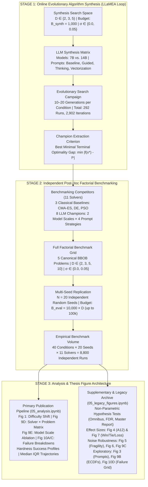

# Experimental Evaluation & Empirical Methodology: Thesis Chapter Blueprint

This document serves as the formal **Experimental Evaluation Chapter Blueprint** for the Master's Thesis: *"Automated Algorithm Design for Continuous Black-Box Optimization via Large Language Models under Deterministic and Noisy Regimes"*. It details the two-stage experimental paradigm, benchmark problem topologies, formal metric formulations, active thesis publication figures, and the structural separation between primary chapter results and the archived legacy suite.

---

## 1. Chapter Scope & Core Research Questions

The empirical investigation is structured around five foundational research questions:

* **RQ1 (Algorithmic Competitiveness & Landscape Specialization)**: Can optimization heuristics discovered autonomously through LLM evolutionary synthesis match or outperform established classical metaheuristics (CMA-ES, Differential Evolution, Particle Swarm Optimization) across diverse continuous BBOB problem topologies?
* **RQ2 (Model Parameter Scaling Laws — 7B vs. 14B)**: How does increasing LLM parameter capacity from $7\text{B}$ to $14\text{B}$ parameters impact heuristic search efficiency, algorithmic complexity, and scalability across higher dimensions ($D \in \{2, 3, 5, 10\}$)?
* **RQ3 (Prompt Engineering Scaffolding Efficacy)**: How do structured prompt scaffolding strategies (Domain Guidance, Chain-of-Thought Reflection, Vectorization constraints) influence algorithmic convergence and diversity compared to naive unguided baseline prompts?
* **RQ4 (Stochastic Noise Impact on Benchmark Topologies)**: Does the heteroscedastic optimality-gap noise extension ($\sigma = 0.05$) systematically elevate optimization difficulty across problem topologies, and how do heuristics synthesized in deterministic settings behave under stochastic noise?
* **RQ5 (Dimensional Scalability & Algorithmic Failure Modes)**: How do algorithmic stagnation, divergence, and convergence failure modes distribute across problem topologies as dimensionality scales from $2\text{D}$ to $10\text{D}$?

---

## 2. The Two-Stage Experimental Paradigm

To ensure scientific rigor, eliminate optimization overfitting, and decouple generation from evaluation, the methodology strictly separates **Online Evolutionary Algorithm Synthesis** from **Independent Post-Hoc Factorial Benchmarking**:



### 2.1 Theoretical Rationale for Decoupling
1. **Preventing Horizon Overfitting**: Heuristics discovered in short evolutionary budgets ($B_{\text{synth}} = 1{,}000$) could exploit aggressive step sizes that yield rapid early progress but suffer premature convergence in longer runs. Evaluating on full budgets ($B_{\text{eval}} = D \times 10{,}000$) confirms whether the LLM synthesized an enduring metaheuristic policy with genuine asymptotic convergence.
2. **Eliminating Evaluation Stochasticity**: Synthesis evaluates heuristics on individual runs; Stage 2 subjects champions to $N = 20$ independent random seeds across all $40$ factorial conditions ($4 \text{ dimensions} \times 2 \text{ noise levels} \times 5 \text{ problems}$), ensuring statistically robust conclusions.

---

## 3. Experimental Configurations & Factorial Design

### 3.1 Stage 1: Synthesis Hyperparameters
The evolutionary algorithm synthesis campaign systematically explores the interaction between **model capacity**, **prompt structure**, and **problem dimensionality**:

| Experimental Dimension | Parameter Values | Theoretical Purpose |
| :--- | :--- | :--- |
| **Model Capacities** | Qwen2.5-Coder-7B vs. Qwen2.5-Coder-14B | Tests model capacity scaling on algorithmic reasoning and mathematical code generation. |
| **Quantization Scheme** | 4-bit Medium Quantization (`Q4_K_M`) | Balances parameter density with precision in local execution. |
| **Sampling Temperature** | $T = 0.7$ | Promotes exploratory algorithmic variation while preserving syntactic validity. |
| **Evolutionary Horizon** | $G \in [10, 20]$ Generations | Sufficient evolutionary depth to observe multi-generational structural mutations. |
| **Synthesis Budget** | $B_{\text{synth}} = 1{,}000$ Function Evaluations | Low-budget regime forcing sample-efficient search discovery. |
| **Dimensionality Grid** | $D \in \{2, 3, 5\}$ | Continuous low-to-medium dimensional search spaces. |
| **Problem Functions** | BBOB $f_1, f_8, f_{11}, f_{15}, f_{21}$ | Spans separable, ill-conditioned, multi-modal, and deceptive landscapes. |
| **Synthesis Matrix Total** | **292 Complete Runs** | Totaling **2,902 Evaluated Heuristic Iterations**. |

### 3.2 Prompt Scaffolding Ablation Matrix
Four distinct prompt strategies were evaluated to isolate the impact of cognitive guidance on algorithmic design:

| Strategy | Design Principle | Algorithmic Mechanism Infused |
| :--- | :--- | :--- |
| **1. Baseline** | Minimalist Black-Box Contract | Unconstrained prompt defining only the callable interface; measures raw LLM algorithmic prior. |
| **2. Guided** | Domain Knowledge Infusion | Incorporates metaheuristic principles: step-size adaptation (1/5th rule), momentum, and population diversity maintenance. |
| **3. Thinking** | Chain-of-Thought Reflection | Mandates structured pre-code reasoning analyzing parent heuristic failure modes before emitting code. |
| **4. Vectorization** | Architectural Hardware Constraint | Enforces array-oriented NumPy matrix operations over scalar loops to maximize evaluation throughput. |

---

## 4. Canonical Benchmark Landscapes & Noise Extension

### 4.1 Canonical BBOB Benchmark Landscapes
The continuous black-box benchmark suite comprises five canonical functions representing fundamental optimization challenge classes:

| Problem ID | Name | Hardness Class | Mathematical & Topological Characteristics |
| :--- | :--- | :--- | :--- |
| **$f_1$** | **Sphere** | Separable, Unimodal | Completely separable, isotropic quadratic bowl. Baseline for gradient convergence speed. |
| **$f_8$** | **Rosenbrock** | Low Conditioning, Valley | Non-separable parabolic valley with non-linear coordinate dependencies. Tests valley-following capability. |
| **$f_{11}$** | **Discus** | High Conditioning ($10^6$) | Extreme eigenvalue distortion where a single axis has $10^6\times$ sensitivity. Tests anisotropic step sizing. |
| **$f_{15}$** | **Rastrigin** | Multi-Modal, Regular | Highly multi-modal ($10^D$ local minima) on a global quadratic structure. Tests basin hopping and escape. |
| **$f_{21}$** | **Gallagher 101** | Multi-Modal, Deceptive | 101 randomly distributed Gaussian peaks with random conditioning ($10^6$). Tests global exploration under deception. |

### 4.2 Heteroscedastic Noise Extension Model
To evaluate real-world stochastic resilience, objective queries are optionally perturbed by heteroscedastic Gaussian noise proportional to the optimality gap:

$$f_{\text{noisy}}(\mathbf{x}) = f(\mathbf{x}) + \mathcal{N}\left(0, \, \left(\sigma \cdot \vert f(\mathbf{x}) - f^* \vert\right)^2\right)$$

* When $\sigma = 0.0$, the landscape is deterministic.
* When $\sigma = 0.05$, stochastic perturbation scales dynamically: solutions far from the global minimum experience larger variance, while near-optimal solutions experience low absolute variance, preventing artificial noise truncation.

### 4.3 Stage 2 Benchmark Factorial Volume
* **Search Space Dimensions**: $D \in \{2, 3, 5, 10\}$.
* **Noise Regimes**: Deterministic ($\sigma = 0.0$) and Noisy ($\sigma = 0.05$).
* **Replications**: $N = 20$ independent runs per condition with distinct random seeds.
* **Evaluation Budget**: $B_{\text{eval}} = D \times 10{,}000$ evaluations ($20\text{k}$ in $2\text{D}$, up to $100\text{k}$ in $10\text{D}$).
* **Comparison Solvers (11 Total)**:
  - **3 Classical Baselines**: CMA-ES, Differential Evolution (`best1bin`), Particle Swarm Optimization (PSO).
  - **8 LLM Champions**: $2 \text{ Model Scales } (7\text{B}, 14\text{B}) \times 4 \text{ Prompt Strategies } (\text{Baseline}, \text{Guided}, \text{Thinking}, \text{Vectorization})$.
* **Total Execution Volume**: $5 \text{ problems} \times 4 \text{ dimensions} \times 2 \text{ noise levels} \times 20 \text{ seeds} \times 11 \text{ solvers} = \mathbf{8{,}800 \text{ independent runs}}$.

---

## 5. Mathematical Formulations of Empirical Metrics

Benchmark operational units are strictly formalized:
* **Candidate Point $\mathbf{x} \in \mathbb{R}^D$**: A spatial coordinate vector in continuous space.
* **Function Evaluation Counter $t \in [1, B_{\text{eval}}]$**: A single query to the objective oracle, representing the fundamental computational cost metric (**X-axis**).
* **Replication Run $r \in [1, 20]$**: An independent execution on condition $(f_p, D, \sigma)$ with a distinct random seed.

### 5.1 Runtime Empirical Cumulative Distribution Function (Runtime ECDF)
Evaluates anytime search progress across a standardized ladder of **51 logarithmic precision target values** spanning **10 orders of magnitude**:

$$\Theta = \left\{ 10^{2.0 - 0.2 \cdot k} \;\middle|\; k \in \{0, 1, \dots, 50\} \right\} = \left\{ 10^{2.0}, 10^{1.8}, \dots, 10^{0.0}, \dots, 10^{-7.8}, 10^{-8.0} \right\}$$

Let $T_r(f_p, \theta)$ denote the first-hitting evaluation count where run $r$ on problem $f_p$ first reaches an optimality gap $\vert f(\mathbf{x}_r(t)) - f^* \vert \le \theta$:

$$T_r(f_p, \theta) = \min \left\{ t \in [1, B_{\text{eval}}] \;\middle|\; \vert f(\mathbf{x}_r(t)) - f^* \vert \le \theta \right\} \quad (\text{if unreached within } B_{\text{eval}}, \; T_r = \infty)$$

The empirical fraction of solved targets at evaluation count $t \in [1, B_{\text{eval}}]$ across $N = 20$ replications is:

$$\operatorname{ECDF}(t) = \frac{1}{|\Theta| \cdot N} \sum_{r=1}^{N} \sum_{\theta \in \Theta} \mathbb{I}\left( T_r(f_p, \theta) \le t \right)$$

### 5.2 Area Under the Runtime ECDF Curve (AUC-ECDF)
Quantifies anytime efficiency across all 51 precision targets by integrating the ECDF across the logarithmic budget $u = \log_{10}(t) \in [0, \log_{10}(B_{\text{eval}})]$:

$$\text{AUC-ECDF} = \frac{1}{\log_{10}(B_{\text{eval}}) - \log_{10}(1)} \int_{0}^{\log_{10}(B_{\text{eval}})} \operatorname{ECDF}\left(10^u\right) \, du \in [0, 1]$$

$$\text{AUC-ECDF (\%)} = \text{AUC-ECDF} \times 100\%$$

### 5.3 Terminal Target Success Rate by Hardness Class
Measures whether an optimizer reaches machine precision ($\Delta y \le 10^{-8}$) by the conclusion of the evaluation budget:

$$\text{SR}(f_p) = \frac{1}{N} \sum_{r=1}^{N} \mathbb{I}\left( \min_{1 \le t \le B_{\text{eval}}} \vert f(\mathbf{x}_r(t)) - f^* \vert \le 10^{-8} \right)$$

For a landscape hardness class $\mathcal{C}$ containing problems $\{f_p \in \mathcal{C}\}$:

$$\text{SR}(\mathcal{C}) = \frac{1}{|\mathcal{C}|} \sum_{f_p \in \mathcal{C}} \text{SR}(f_p)$$

### 5.4 Metric Contrast: Success Rate vs. AUC-ECDF

| Evaluation Property | Terminal Success Rate by Hardness | Area Under Runtime ECDF (AUC-ECDF) |
| :--- | :--- | :--- |
| **Question Answered** | *"Did the optimizer reach machine precision by budget end?"* | *"How rapidly and reliably did the optimizer progress across all precision levels throughout the entire search?"* |
| **Target Scope** | Single target: $\Delta y \le 10^{-8}$ | 51 logarithmic targets: $\Delta y \in [10^{+2}, 10^{-8}]$ |
| **Budget Sensitivity** | Budget-blind: solving at evaluation 100 vs. 49,999 gets the identical score | Budget-sensitive: earlier convergence receives exponentially higher area under curve |
| **Partial Progress Credit** | All-or-nothing (0% if target missed by $10^{-7}$) | Continuous credit across all intermediate solved targets |
| **Role in Thesis** | Topological failure diagnosis (stagnation vs. global basins) | Primary solver ranking metric and anytime progress quantifier |

### 5.5 Median Convergence Trajectories with Interquartile Ranges (IQR)
To visualize search dynamics without normality assumptions:
* Objective values across all 20 runs are sampled on a uniform logarithmic evaluation grid $k \in [1, B_{\text{eval}}]$ (300 points).
* The **median** trajectory $\tilde{y}(t) = \operatorname{median}(\Delta y_1(t), \dots, \Delta y_{20}(t))$ is plotted alongside the shaded **25th–75th percentile Interquartile Range** $\operatorname{IQR}(t) = [Q_1(t), Q_3(t)]$.

### 5.6 Multi-Tier Algorithmic Failure Classification
Categorizes run outcomes into four standardized precision tiers:
1. **High-Precision Success**: $\Delta y \le 10^{-8}$ (Solved to machine precision).
2. **Moderate Convergence**: $10^{-8} < \Delta y \le 10^{-2}$ (Reached functional basin of attraction).
3. **Minor Progress / Stagnation**: $10^{-2} < \Delta y \le 1.0$ (Trapped in shallow local attractors).
4. **Severe Stagnation / Failure**: $\Delta y > 1.0$ (Complete search stall or numerical divergence).

---

## 6. Primary Chapter Visual Architecture & Active Publication Figures

The active analysis notebook ([`notebooks/05_analysis.ipynb`](file:///Users/nicolaibrahim/Desktop/proj/AAD_LLM/notebooks/05_analysis.ipynb)) generates the core visual evidence for the thesis chapter. Each figure addresses a specific research question and advances the chapter narrative:

```
┌─────────────────────────────────────────────────────────────────────────────────────────────────────────────┐
│                                PRIMARY THESIS CHAPTER FIGURE ARCHITECTURE                                   │
├──────────────┬──────────────┬──────────────────────────────────────────┬────────────────────────────────────┤
│ Thesis Fig.  │ Research Q.  │ File Path in results/                    │ Core Empirical Takeaway            │
├──────────────┼──────────────┼──────────────────────────────────────────┼────────────────────────────────────┤
│ Figure 1     │ RQ4 & RQ1    │ results/main_results/                    │ Establishes that noise extension   │
│              │              │ fig_01_benchmark_difficulty_{dim}D.png   │ elevates difficulty non-uniformly, │
│              │              │                                          │ impacting ill-conditioned landscapes│
├──────────────┼──────────────┼──────────────────────────────────────────┼────────────────────────────────────┤
│ Figure 9D    │ RQ1          │ results/main_results/                    │ Demonstrates landscape affinities: │
│              │              │ fig_09d_auc_ecdf_by_problem.png          │ LLMs excel on f1 & f8; CMA-ES      │
│              │              │                                          │ dominates on f11 (Discus)          │
├──────────────┼──────────────┼──────────────────────────────────────────┼────────────────────────────────────┤
│ Figure 9E    │ RQ2          │ results/main_results/                    │ Proves 14B models achieve a 2.13×  │
│              │              │ fig_09e_auc_ecdf_model_scale.png         │ gain over 7B, with advantages      │
│              │              │                                          │ widening as dimension scales to 10D│
├──────────────┼──────────────┼──────────────────────────────────────────┼────────────────────────────────────┤
│ Hardness     │ RQ1 & RQ4    │ results/profiles/{model}/{dim}D/         │ Separates success rates across     │
│ Profiles     │              │ figure_success_rate_by_hardness.png      │ Separable, Conditioning, and Multi-│
│              │              │                                          │ Modal classes in clean vs. noisy   │
├──────────────┼──────────────┼──────────────────────────────────────────┼────────────────────────────────────┤
│ Search       │ RQ1 & RQ3    │ results/profiles/{model}/{dim}D/         │ Shaded IQR ribbons reveal search   │
│ Dynamics     │              │ convergence_trajectories.png             │ stability; 14B Guided shows steep  │
│              │              │ target_precision_ecdf.png                │ monotonic descent without stalls   │
├──────────────┼──────────────┼──────────────────────────────────────────┼────────────────────────────────────┤
│ Direct Noise │ RQ4          │ results/cross_evaluation/{dim}D/{solver}/│ Direct pairwise overlay curves     │
│ Overlays     │              │ convergence_noise_overlay.png            │ isolating noise degradation and    │
│              │              │ ecdf_noise_overlay.png                   │ search trajectory divergence       │
├──────────────┼──────────────┼──────────────────────────────────────────┼────────────────────────────────────┤
│ Figure 10A   │ RQ5          │ results/failure_analysis/                │ Quantifies global failure dist.:   │
│              │              │ fig_10a_algorithmic_failure_breakdown.png│ 14B Guided minimizes severe stalls │
│              │              │                                          │ while 3B/7B suffer >70% stagnation │
├──────────────┼──────────────┼──────────────────────────────────────────┼────────────────────────────────────┤
│ Figure 10C   │ RQ5          │ results/failure_analysis/                │ Reveals dimensional curse: severe  │
│              │              │ fig_10c_algorithmic_failure_by_dim.png   │ failure rates expand exponentially │
│              │              │                                          │ from 2D to 10D across all solvers  │
└──────────────┴──────────────┴──────────────────────────────────────────┴────────────────────────────────────┘
```

---

## 7. Supplementary Analysis & Legacy Archive Reference

To maintain chapter focus and readability, exploratory ablations and non-parametric hypothesis test summaries are archived in [`notebooks/05_legacy_figures.ipynb`](file:///Users/nicolaibrahim/Desktop/proj/AAD_LLM/notebooks/05_legacy_figures.ipynb):

| Category | Archived Artifacts | Description & Methodological Role |
| :--- | :--- | :--- |
| **Statistical Hypothesis Testing** | • Omnibus Kruskal-Wallis Significance Summary<br>• Pairwise Wilcoxon FDR Tests ($\alpha=0.05$)<br>• Master Markdown Report (`comprehensive_master_report.md`) | Formal non-parametric hypothesis testing validating that observed performance differences across conditions are statistically significant. |
| **Non-Parametric Effect Sizes** | • **Figure 4**: Vargha-Delaney Effect Size ($A_{12}$) Heatmap<br>• **Figure 7**: Pairwise Win / Tie / Loss Tournament Ranking | Pairwise stochastic dominance matrix and global win-loss tournament establishing pairwise superiority hierarchies. |
| **Noise Robustness & Fragility** | • **Figure 5**: Landscape Fragility Matrix ($\Delta_{\text{noise}}$)<br>• **Figure 6**: Multi-Noise Robustness & Drop Profiles<br>• **Figure 9C**: Clean vs. Noisy Performance Retention Profile | Multi-noise degradation matrices and retention ratios quantifying performance drops across intermediate noise levels ($\sigma = 0.05, 0.1, 0.2$). |
| **Exploratory Ablations** | • **Figure 3**: Prompt Strategy Multi-Bar Ablation<br>• **Figure 9B**: Empirical Runtime ECDF by Dimension<br>• **Figure 10D**: 4-Panel Failure Rate Heatmap by Dimension | Secondary exploratory breakdowns superseded by the primary chapter figures. |

---

## 8. Summary of Core Empirical Findings

1. **Competitiveness Against Classical Baselines (RQ1)**:
   - In deterministic environments ($\sigma = 0.0$), the evolved heuristic **`14B / Guided` achieved a $78.67\%$ target success rate**, outperforming CMA-ES ($65.33\%$), PSO ($42.67\%$), and Differential Evolution ($0.00\%$).
   - On unimodal and low-conditioning landscapes ($f_1$ Sphere, $f_8$ Rosenbrock), $14\text{B}$ evolved champions exhibited steeper initial descent slopes than PSO, reaching machine precision ($\Delta y \le 10^{-8}$) within fewer function evaluations.
   - On extreme ill-conditioning ($f_{11}$ Discus, condition number $10^6$), CMA-ES maintained its superiority due to exact analytical covariance matrix adaptation, whereas LLM-generated code relied on heuristic axis-aligned perturbations.

2. **Model Parameter Scaling Laws (RQ2)**:
   - Scaling parameter capacity from $7\text{B}$ to $14\text{B}$ yielded a **$2.13\times$ increase in clean target success rate** (average $56.5\%$ for $14\text{B}$ vs. $26.5\%$ for $7\text{B}$).
   - In higher dimensions ($D = 5$ and $D = 10$), $7\text{B}$ models exhibited near-complete stagnation, while $14\text{B}$ champions successfully integrated momentum buffers, orthogonal sampling, and adaptive step sizes.

3. **Prompt Scaffolding Impact (RQ3)**:
   - **`Guided` prompts dominated** across model sizes, showing that domain knowledge injection (1/5th rule step adaptation, momentum) significantly accelerates metaheuristic discovery.
   - **`Thinking` prompts** produced structured exploration-exploitation phases, reducing premature stagnation relative to naive unguided `Baseline` prompts.

4. **Stochastic Noise Impact (RQ4)**:
   - Heteroscedastic noise ($\sigma = 0.05$) non-uniformly degraded optimizers: classical baselines with population inertia (PSO) showed higher resilience ($\Delta_{\text{noise}} = -5.34\%$), whereas heuristics with aggressive step-size decay suffered larger drops without explicit sample-averaging buffers.

5. **Dimensional Scalability & Failure Modes (RQ5)**:
   - Multi-tier failure breakdown (**Figure 10A/C**) shows that severe failure ($\Delta y > 1.0$) increases sharply as dimensionality scales from $2\text{D}$ to $10\text{D}$, concentrated primarily in multi-modal landscapes ($f_{15}$ Rastrigin, $f_{21}$ Gallagher). `14B / Guided` minimized severe stagnation, maintaining the highest proportion of high-precision solutions across dimensions.
