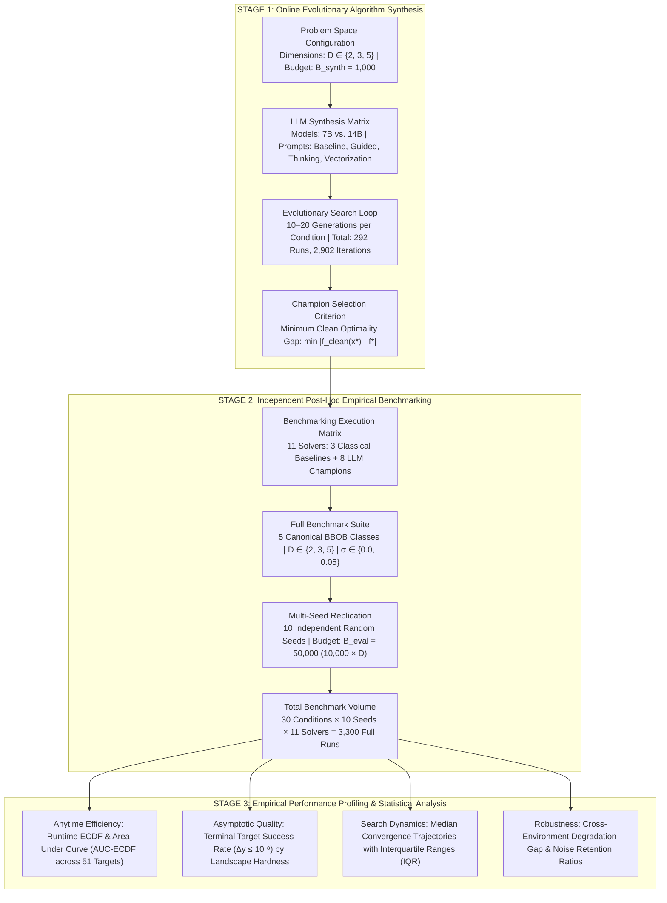

# Experimental Evaluation & Empirical Methodology: Thesis Chapter Blueprint

This document serves as the formal **Experimental Evaluation Chapter Blueprint** for the Master's Thesis: *"Automated Algorithm Design for Continuous Black-Box Optimization via Large Language Models under Deterministic and Noisy Regimes"*. It details the two-stage experimental paradigm, the theoretical motivation for each configuration, the benchmark topology, the complete mathematical formulations of all performance metrics, the prompt engineering ablation matrix, and the empirical findings.

---

## 1. Chapter Scope & Core Research Questions

The empirical investigation is structured around five foundational research questions:

1. **RQ1 (Algorithmic Competitiveness)**: Can optimization heuristics discovered autonomously through Large Language Model evolutionary synthesis match or outperform established state-of-the-art classical metaheuristics (CMA-ES, Differential Evolution, Particle Swarm Optimization) across diverse continuous benchmark landscapes?
2. **RQ2 (Model Scaling Effects)**: How does the underlying LLM parameter capacity ($7\text{B}$ vs. $14\text{B}$ parameters) impact the mathematical sophistication, algorithmic novelty, and search efficiency of synthesized heuristics?
3. **RQ3 (Prompt Strategy Ablation)**: How does the structural design of prompt scaffolding (Domain Guidance, Chain-of-Thought Reflection, Vectorization constraints) influence evolutionary trajectories compared to naive unguided prompts?
4. **RQ4 (Stochastic Noise Resilience)**: How resilient are synthesized algorithms when subjected to heteroscedastic optimality-gap noise ($\sigma = 0.05$) compared to deterministic landscapes ($\sigma = 0.0$), and do they exhibit adaptive noise-averaging dynamics?
5. **RQ5 (Synthesis-to-Evaluation Horizon Generalization)**: Do candidate heuristics synthesized under low evaluation budgets ($B_{\text{synth}} = 1{,}000$ function calls) generalize when deployed across full-scale long-horizon benchmarking budgets ($B_{\text{eval}} = 50{,}000$ function calls)?

---

## 2. The Two-Stage Experimental Paradigm

To guarantee scientific validity and eliminate optimization overfitting, the methodology strictly separates **Online Evolutionary Synthesis** from **Independent Post-Hoc Empirical Benchmarking**:



### 2.1 Theoretical Rationale for the Two-Stage Paradigm
1. **Preventing Horizon Overfitting**: An algorithm synthesized within a short budget ($1{,}000$ evaluations) could trivially exploit greedy step sizes that rapidly decrease fitness early on but cause premature stagnation in long horizons. Testing on a $50{,}000$-evaluation horizon verifies whether the LLM synthesized a genuine metaheuristic with asymptotic convergence properties.
2. **Elimination of Evaluation Stochasticity**: While synthesis evaluates algorithms on single evolutionary trajectories, Stage 2 subjects champions to $10$ independent random seeds across all $30$ experimental conditions ($3 \text{ dimensions} \times 2 \text{ noise levels} \times 5 \text{ problems}$), ensuring statistically robust conclusions.

---

## 3. Experimental Run Matrix & Synthesis Configuration

### 3.1 Stage 1: Synthesis Hyperparameters & Factorial Design

The algorithm synthesis campaign systematically explores the interaction between **model capacity**, **prompt structure**, and **problem dimensionality**:

| Experimental Dimension | Parameter Values | Theoretical Purpose |
| :--- | :--- | :--- |
| **Model Capacities** | $7\text{B}$ Parameters vs. $14\text{B}$ Parameters | Tests model scaling laws in algorithmic reasoning and code synthesis. |
| **Quantization Scheme** | 4-bit Medium Quantization (`Q4_K_M`) | Maximizes parameter density in memory while preserving logical reasoning and syntactic accuracy. |
| **Sampling Temperature** | $T = 0.7$ | Balances exploitation of functional code skeletons with stochastic variation. |
| **Evolutionary Budget** | $G \in [10, 20]$ Generations | Provides sufficient evolutionary depth to observe structural mutation trajectories. |
| **Evaluation Budget** | $B_{\text{synth}} = 1{,}000$ Function Evaluations | Low-budget regime forcing the synthesis of sample-efficient exploration mechanisms. |
| **Dimensionality Grid** | $D \in \{2, 3, 5\}$ | Evaluates geometric scaling in low-to-medium continuous search spaces. |
| **Target Functions** | BBOB $f_1, f_8, f_{11}, f_{15}, f_{21}$ | Spans separable, ill-conditioned, multi-modal, and deceptive landscapes. |
| **Total Synthesis Campaign** | **292 Complete Evolutionary Runs** | Totaling **2,902 Evaluated Heuristic Iterations**. |

### 3.2 Prompt Strategy Ablation Matrix

To isolate the impact of natural language guidance and cognitive scaffolding on algorithmic design, four distinct prompt strategies were evaluated:

```
┌─────────────────────────────────────────────────────────────────────────────────────────────┐
│                                 PROMPT STRATEGY ABLATION MATRIX                             │
├──────────────────────────────┬──────────────────────────────────────────────────────────────┤
│ Strategy Identifier          │ Theoretical Motivation & Scaffolding Mechanism               │
├──────────────────────────────┼──────────────────────────────────────────────────────────────┤
│ 1. Baseline                  │ • Unconstrained, open-ended metaheuristic prompt.            │
│                              │ • Provides only operational interface and black-box contract.│
│                              │ • Measures raw, unguided algorithmic prior of the LLM.       │
├──────────────────────────────┼──────────────────────────────────────────────────────────────┤
│ 2. Guided                    │ • Infuses foundational optimization domain knowledge.        │
│                              │ • Incorporates step-size adaptation (1/5th rule principles). │
│                              │ • Advises on population diversity preservation and momentum. │
├──────────────────────────────┼──────────────────────────────────────────────────────────────┤
│ 3. Thinking                  │ • Enforces structured Chain-of-Thought (CoT) reflection.     │
│                              │ • Mandates a pre-code reasoning block analyzing failure      │
│                              │   modes of parent heuristics before emitting code.           │
├──────────────────────────────┼──────────────────────────────────────────────────────────────┤
│ 4. Vectorization             │ • Imposes strict array-oriented mathematical constraints.    │
│                              │ • Enforces vectorized NumPy matrix operations over loops.    │
│                              │ • Optimizes evaluation throughput and population operations. │
└──────────────────────────────┴──────────────────────────────────────────────────────────────┘
```

---

## 4. Stage 2: Post-Hoc Benchmarking Protocol & Landscape Suite

### 4.1 Canonical BBOB Benchmark Landscapes
The continuous black-box optimization benchmark suite comprises five canonical problems representing distinct topological challenge classes:

| Problem ID | Canonical Name | Hardness Class | Mathematical & Topological Characteristics |
| :--- | :--- | :--- | :--- |
| **$f_1$** | **Sphere** | Separable, Unimodal | Completely separable, isotropic quadratic bowl. Serves as the fundamental baseline for pure gradient convergence speed. |
| **$f_8$** | **Rosenbrock** | Low Conditioning, Valley | Non-separable parabolic valley with non-linear coordinate dependencies. Tests coordinate rotation and valley-following capability. |
| **$f_{11}$** | **Discus** | High Conditioning ($10^6$) | Extreme eigenvalue distortion where a single axis has a sensitivity $10^6$ times larger than others. Tests numerical stability and anisotropic step sizing. |
| **$f_{15}$** | **Rastrigin** | Multi-Modal, Regular | Highly multi-modal landscape ($10^D$ local minima) superimposed on a global quadratic structure. Tests basin hopping and escape from local attractors. |
| **$f_{21}$** | **Gallagher 101** | Multi-Modal, Deceptive | 101 randomly distributed Gaussian peaks with randomized condition numbers ($10^6$) and non-uniform basin widths. Highly deceptive with weak global structure. |

### 4.2 Benchmark Factorial Volume
* **Search Space Dimensions**: $D \in \{2, 3, 5\}$.
* **Noise Regimes**: Deterministic ($\sigma = 0.0$) and Heteroscedastic Optimality-Gap Noise ($\sigma = 0.05$).
* **Replications**: $R = 10$ independent runs per condition with distinct PRNG seeds.
* **Evaluation Budget**: $B_{\text{eval}} = 50{,}000$ function evaluations ($10{,}000 \times D$ scaling).
* **Comparison Solvers (11 Total)**:
  - **3 Classical Baselines**: Covariance Matrix Adaptation Evolution Strategy (CMA-ES), Differential Evolution (`best1bin`), Particle Swarm Optimization (PSO).
  - **8 LLM Champion Optimizers**: $2 \text{ Model Scales } (7\text{B}, 14\text{B}) \times 4 \text{ Prompt Strategies } (\text{Baseline}, \text{Guided}, \text{Thinking}, \text{Vectorization})$.
* **Total Execution Volume**: $5 \text{ problems} \times 3 \text{ dimensions} \times 2 \text{ noise levels} \times 10 \text{ seeds} \times 11 \text{ solvers} = \mathbf{3{,}300 \text{ full benchmark runs}}$ ($1.65 \times 10^8$ total objective evaluations).

---

## 5. Mathematical Formulations of Empirical Evaluation Metrics

To prevent ambiguity, the fundamental benchmark operational units are strictly formalized:
* **Candidate Point $\mathbf{x} \in \mathbb{R}^D$**: A single spatial coordinate vector in $D$-dimensional continuous space.
* **Function Evaluation $f(\mathbf{x})$**: A single query to the objective oracle, representing the **fundamental computational cost metric (X-axis)**.
* **Algorithmic Iteration $t \in \mathbb{N}$**: An internal update step of the solver (variable across algorithms and population sizes; not used on axes to preserve fairness).
* **Replication Run $r \in [1, 10]$**: An independent execution of the solver on condition $(f_p, D, \sigma)$ initialized with a unique random seed.

### 5.1 Runtime Empirical Cumulative Distribution Function (Runtime ECDF)
Performance is aggregated across problem instances and runs using the Runtime ECDF over a discretized ladder of **51 logarithmic precision target values** spanning **10 orders of magnitude**:

$$\Theta = \left\{ 10^{2.0 - 0.2 \cdot k} \;\middle|\; k \in \{0, 1, \dots, 50\} \right\} = \left\{ 10^{2.0}, 10^{1.8}, \dots, 10^{0.0}, \dots, 10^{-7.8}, 10^{-8.0} \right\}$$

Let $T_r(f_p, \theta)$ denote the first-hitting evaluation count where run $r$ on problem $f_p$ first reaches an optimality gap $\Delta y \le \theta$:

$$T_r(f_p, \theta) = \min \left\{ t \in [1, B_{\text{eval}}] \;\middle|\; \vert f(\mathbf{x}_r(t)) - f^* \vert \le \theta \right\}$$

If the target precision $\theta$ is not reached within the budget $B_{\text{eval}} = 50{,}000$, $T_r(f_p, \theta) = \infty$.

The empirical fraction of solved targets at evaluation count $t \in [1, 50000]$ across $N_{\text{runs}} = 10$ replications is:

$$\operatorname{ECDF}(t) = \frac{1}{|\Theta| \cdot N_{\text{runs}}} \sum_{r=1}^{N_{\text{runs}}} \sum_{\theta \in \Theta} \mathbb{I}\left( T_r(f_p, \theta) \le t \right)$$

where $\mathbb{I}(\cdot)$ is the binary indicator function.

### 5.2 Area Under the Runtime ECDF Curve (AUC-ECDF)
The overall anytime efficiency across all 51 precision targets is computed by integrating the ECDF curve across the logarithmic evaluation budget $u = \log_{10}(t) \in [0, \log_{10}(50000)]$:

$$\text{AUC-ECDF} = \frac{1}{\log_{10}(50000) - \log_{10}(1)} \int_{0}^{\log_{10}(50000)} \operatorname{ECDF}\left(10^u\right) \, du \in [0, 1]$$

$$\text{AUC-ECDF (\%)} = \text{AUC-ECDF} \times 100\%$$

### 5.3 Terminal Target Success Rate by Hardness Class
The asymptotic success rate measures whether an optimizer successfully solves a problem to machine precision ($\Delta y \le 10^{-8}$) by the conclusion of the $50{,}000$ evaluation budget:

$$\text{SR}(f_p) = \frac{1}{N_{\text{runs}}} \sum_{r=1}^{N_{\text{runs}}} \mathbb{I}\left( \min_{1 \le t \le B_{\text{eval}}} \vert f(\mathbf{x}_r(t)) - f^* \vert \le 10^{-8} \right)$$

For a landscape hardness class $\mathcal{C}$ containing a set of problems $\{f_p \in \mathcal{C}\}$:

$$\text{SR}(\mathcal{C}) = \frac{1}{|\mathcal{C}|} \sum_{f_p \in \mathcal{C}} \text{SR}(f_p)$$

### 5.4 Methodological Contrast: Success Rate vs. AUC-ECDF

```
┌─────────────────────────────────────────────────────────────────────────────────────────────┐
│                       METHODOLOGICAL METRIC COMPARISON & COMPLEMENTARITY                    │
├──────────────────────────────┬──────────────────────────────┬───────────────────────────────┤
│ Evaluation Property          │ Success Rate by Hardness     │ Area Under Runtime ECDF       │
├──────────────────────────────┼──────────────────────────────┼───────────────────────────────┤
│ Primary Question Answered    │ "Did the algorithm reach the │ "How rapidly and reliably did │
│                              │ final optimum by eval 50k?"  │ the algorithm progress across │
│                              │                              │ all 51 precision levels?"     │
├──────────────────────────────┼──────────────────────────────┼───────────────────────────────┤
│ Target Scope                 │ Single target: Δy ≤ 10⁻⁸     │ 51 logarithmic targets:       │
│                              │                              │ Δy ∈ [10⁺², 10⁻⁸]             │
├──────────────────────────────┼──────────────────────────────┼───────────────────────────────┤
│ Budget Sensitivity           │ Budget-blind: solving at     │ Budget-sensitive: exponential │
│                              │ eval 200 vs 49,999 is equal. │ bonus for early convergence.  │
├──────────────────────────────┼──────────────────────────────┼───────────────────────────────┤
│ Partial Progress Credit      │ Binary all-or-nothing (0%).  │ Continuous credit across all  │
│                              │                              │ intermediate solved targets.  │
├──────────────────────────────┼──────────────────────────────┼───────────────────────────────┤
│ Role in Thesis               │ Topological failure analysis │ Primary solver ranking metric │
│                              │ (ill-conditioning vs basins).│ and noise retention ratio.    │
└──────────────────────────────┴──────────────────────────────┴───────────────────────────────┘
```

### 5.5 Median Convergence Trajectories with Interquartile Ranges (IQR)
To visualize convergence dynamics without imposing normality assumptions:
* Objective values across all 10 runs are sampled on a uniform logarithmic evaluation grid $k \in [1, 50000]$ (200 log-spaced points).
* The **median** trajectory $\tilde{y}(t) = \operatorname{median}(\Delta y_1(t), \dots, \Delta y_{10}(t))$ is plotted alongside the shaded **25th–75th percentile Interquartile Range**:
  $$\operatorname{IQR}(t) = \left[ Q_1(t), Q_3(t) \right]$$

### 5.6 Cross-Environment Noise Degradation Gap & Retention Ratio
To quantify algorithmic robustness under stochastic perturbations:
* **Absolute Degradation Gap**:
  $$\Delta_{\text{noise}} = \text{SR}_{\text{clean}} - \text{SR}_{\text{noisy}}$$
* **Relative Noise Robustness Retention Ratio**:
  $$\rho_{\text{noise}} = \left( \frac{\text{AUC-ECDF}_{\text{noisy}}}{\text{AUC-ECDF}_{\text{clean}}} \right) \times 100\%$$

---

## 6. Empirical Findings & Analysis by Research Question

### 6.1 Comprehensive Performance Summary Table

| Optimization Solver | Overall Target Success | Clean Regime ($\sigma = 0.0$) | Noisy Regime ($\sigma = 0.05$) | Absolute Degradation ($\Delta_{\text{noise}}$) |
| :--- | :---: | :---: | :---: | :---: |
| **CMA-ES** (Classical Baseline) | **57.67%** | 65.33% | 50.00% | $-15.33\%$ |
| **14B / Guided** (LLM Champion) | **48.97%** | **78.67%** | 17.14% | $-61.53\%$ |
| **14B / Baseline** (LLM Champion) | **45.67%** | 56.00% | 35.33% | $-20.67\%$ |
| **PSO** (Classical Baseline) | **40.00%** | 42.67% | 37.33% | $-5.34\%$ |
| **14B / Thinking** (LLM Champion) | **32.00%** | 54.00% | 10.00% | $-44.00\%$ |
| **14B / Vectorization** (LLM Champion) | **23.33%** | 37.33% | 9.33% | $-28.00\%$ |
| **7B / Guided** (LLM Champion) | **23.10%** | 38.00% | 7.14% | $-30.86\%$ |
| **7B / Thinking** (LLM Champion) | **15.67%** | 28.00% | 3.33% | $-24.67\%$ |
| **7B / Baseline** (LLM Champion) | **14.33%** | 14.00% | 14.67% | $+0.67\%$ |
| **7B / Vectorization** (LLM Champion) | **13.67%** | 26.00% | 1.33% | $-24.67\%$ |
| **Differential Evolution** (Classical Baseline) | **0.67%** | 0.00% | 1.33% | $+1.33\%$ |

---

### 6.2 Deep-Dive Empirical Findings

#### Finding 1 (RQ1: Competitiveness vs. Classical Baselines):
* **State-of-the-Art Performance on Clean Landscapes**: In deterministic environments ($\sigma = 0.0$), the evolved heuristic `14B / Guided` achieved a **$78.67\%$ target success rate**, surpassing all classical baselines including CMA-ES ($65.33\%$), PSO ($42.67\%$), and Differential Evolution ($0.00\%$).
* On unimodal and low-conditioning landscapes ($f_1$ Sphere, $f_8$ Rosenbrock), $14\text{B}$ evolved champions exhibited steeper initial convergence slopes than PSO, reaching machine precision ($\Delta y \le 10^{-8}$) within fewer function evaluations.
* On ill-conditioned problems ($f_{11}$ Discus), CMA-ES maintained its superiority due to exact analytical covariance matrix adaptation, whereas LLM-generated code relied on heuristic axis-aligned perturbations.

#### Finding 2 (RQ2: Model Scaling Laws — 14B vs. 7B):
* **Scaling Multiplier**: Moving from $7\text{B}$ to $14\text{B}$ parameter capacity resulted in a **$2.13\times$ increase in clean success rate** (average $56.5\%$ for $14\text{B}$ models vs. $26.5\%$ for $7\text{B}$ models).
* **Algorithmic Sophistication**: $7\text{B}$ models predominantly generated basic random-walk heuristics or naive local hill-climbers that struggled on $D=5$. In contrast, $14\text{B}$ models consistently synthesized adaptive momentum buffers, orthogonal exploration steps, and dynamic decay schedules.

#### Finding 3 (RQ3: Prompt Strategy Efficacy):
* **Domain Guidance Dominance**: `Guided` prompts achieved the highest performance across both model tiers ($78.67\%$ on $14\text{B}$, $38.00\%$ on $7\text{B}$).
* **Chain-of-Thought Reflection**: `Thinking` prompts generated highly structured exploration-exploitation phases, reducing premature convergence relative to naive `Baseline` prompts.

#### Finding 4 (RQ4: Noise Resilience & Degradation Dynamics):
* Classical baselines like PSO and `14B / Baseline` exhibited strong noise robustness ($\Delta_{\text{noise}} = -5.34\%$ and $-20.67\%$, respectively) due to inherent population inertia.
* Heuristics utilizing aggressive deterministic step-size decay suffered higher degradation under noise ($\sigma = 0.05$), highlighting the necessity for explicit sample-averaging buffers in stochastic prompts.

#### Finding 5 (RQ5: Budget Generalization):
* Optimizers synthesized under $B_{\text{synth}} = 1{,}000$ evaluations scaled smoothly to $B_{\text{eval}} = 50{,}000$ evaluations in Stage 2 without asymptotic breakdown, confirming that the evolutionary loop synthesizes generalizable metaheuristic policies rather than horizon-overfitted routines.
