# Mathematical & Conceptual Comparison: Success Rate by Hardness vs. AUC-ECDF

This report details the theoretical foundation, mathematical definitions, and practical differences between:
1. **Terminal Success Rate by Landscape Hardness** (`figure_success_rate_by_hardness.png`)
2. **Empirical Runtime Cumulative Distribution Function (AUC-ECDF)** (`fig_09b`, `fig_09c`, `fig_09d`, `fig_09e`)

---

## 1. High-Level Comparison Matrix

| Property | Success Rate by Hardness | Area Under Runtime ECDF (AUC-ECDF) |
| :--- | :--- | :--- |
| **Question Answered** | *"Did the optimizer reach the global minimum by evaluation 50,000?"* | *"How fast and reliably did the optimizer progress across all precision levels throughout the entire search?"* |
| **Target Precision** | **Single target:** Final error &Delta;y &le; 10⁻⁸ | **51 logarithmic targets:** &Delta;y &isin; [10⁺², 10⁻⁸] |
| **Time Sensitivity** | ❌ **Budget-blind:** Solving at evaluation 100 vs. 49,999 gets the identical score | ✅ **Budget-sensitive:** Earlier convergence gives an exponentially larger area under curve |
| **Partial Progress** | ❌ **All-or-nothing:** Reaching &Delta;y = 10⁻⁷ is scored as 0.0 | ✅ **Continuous credit:** Partial progress is credited across all intermediate targets |
| **Role in Thesis** | Hardness diagnosis (e.g. ill-conditioning failure vs. multi-modal traps) | Primary benchmark ranking metric, statistical omnibus tests, and noise retention analysis |

---

## 2. Pipeline Flowchart

```mermaid
graph TD
    subgraph S1["Terminal Success Rate by Hardness"]
        A["Run Traces (N = 10)"] --> B["Extract Final Best Error: min Δy(t)"]
        B --> C["Binary Threshold Check: min Δy(t) ≤ 10⁻⁸"]
        C --> D["Average over Hardness Class Instances"]
    end

    subgraph S2["AUC-ECDF (IOHprofiler Standard)"]
        E["Run Traces (N = 10)"] --> F["51 Targets from 10⁺² down to 10⁻⁸"]
        F --> G["Find First-Hitting Evaluation Count per Target"]
        G --> H["Build ECDF Curve: F(t) vs log10(Evaluations)"]
        H --> I["Integrate Area Under Curve: AUC-ECDF (%)"]
    end
```

---

## 3. Mathematical Formulations (Clean Notation)

### 3.1. Terminal Success Rate by Hardness (SR)

Let an algorithm execute **N = 10** independent runs on problem **f_p** belonging to a BBOB landscape hardness class **C** (*Separable*, *Low Conditioning*, *High Conditioning*, *Multi-Modal Global*, *Multi-Modal Weak*).

> **Step 1: Terminal Minimum Error per Run (y_i\*)**  
> For run *i*, find the lowest error achieved by the final evaluation budget (*T_max = 50,000*):  
> **y_i\* = min { &Delta;y_i(t) }** for *t* &isin; [1, 50000]

> **Step 2: Problem-Level Success Rate (SR(f_p))**  
> Calculate the percentage of runs that reached machine precision (&Delta;y &le; 10⁻⁸):  
> **SR(f_p) = (1 / N) &times; &sum; I( y_i\* &le; 10⁻⁸ )**  
> *(where I(&middot;) is 1 if the condition is met, and 0 otherwise)*

> **Step 3: Class-Level Aggregation (SR(C))**  
> Average the success rate across all problem instances in hardness class *C*:  
> **SR(C) = (1 / |C|) &times; &sum; SR(f_p)** for all *f_p* &isin; *C*

---

### 3.2. Empirical Runtime Cumulative Distribution Function (AUC-ECDF)

Let **T = { &tau;₁, &tau;₂, ..., &tau;₅₁ }** be a grid of **51 logarithmic precision targets**:
* &tau;₁ = 10⁺² = 100.0
* &tau;₂ &approx; 63.1
* ...
* &tau;₅₀ = 10⁻⁷ = 0.0000001
* &tau;₅₁ = 10⁻⁸ = 0.00000001

Formula: **&tau;_k = 10^( 2 - 0.2 &times; (k - 1) )** for *k = 1, 2, ..., 51*

> **Step 1: First-Hitting Time (T_i)**  
> The exact evaluation count *t* where run *i* first reaches error &Delta;y &le; &tau;_k:  
> **T_i(f_p, &tau;_k) = min { t &ge; 1 | &Delta;y_i(t) &le; &tau;_k }**  
> *(If the target is never reached within 50,000 evaluations, T_i = &infin;)*

> **Step 2: Empirical Cumulative Distribution Function (F(t))**  
> At any evaluation budget *t* &isin; [1, 50000], the proportion of all (run, target) pairs solved:  
> **F(t) = (1 / (N &times; 51)) &times; &sum; &sum; I( T_i(f_p, &tau;_k) &le; t )**

> **Step 3: Area Under the ECDF Curve (AUC-ECDF %)**  
> Integrate F(t) across the logarithmic evaluation scale *u = log10(t)* from *0* to *log10(50000) &approx; 4.699*:  
> **AUC-ECDF = (1 / log10(50000)) &times; &int; F(10^u) du**  
> **AUC-ECDF (%) = AUC-ECDF &times; 100%**

---

## 4. Practical Example: Why Both Metrics Are Essential

Assume 3 different algorithms run on the **Sphere problem (f1)** with a budget of 50,000 evaluations:

1. **Algorithm A (Fast Solver, e.g. CMA-ES):** Reaches error &Delta;y &le; 10⁻⁸ in **250 evaluations**.
2. **Algorithm B (Slow Solver):** Reaches error &Delta;y &le; 10⁻⁸ in **48,000 evaluations**.
3. **Algorithm C (Stagnating Solver):** Reaches error &Delta;y &le; 10⁻⁶ in **1,000 evaluations**, but plateaus and never reaches 10⁻⁸.

### Quantitative Outcome Comparison:

| Metric | Algorithm A (Fast) | Algorithm B (Slow) | Algorithm C (Partial Progress) |
| :--- | :---: | :---: | :---: |
| **Success Rate (&Delta;y &le; 10⁻⁸)** | **100%** | **100%** *(Indistinguishable from A)* | **0%** *(Treated as complete failure)* |
| **AUC-ECDF (%)** | **&approx; 91.4%** *(High reward for fast convergence)* | **&approx; 34.2%** *(Penalized for late convergence)* | **&approx; 41.8%** *(Credited for solving 41 of 51 targets)* |

---

## 5. Summary of Roles in the Thesis

1. **`figure_success_rate_by_hardness.png` (Structural Failure Analysis):**
   * Shows which landscape difficulties (e.g. conditioning distortion in *Discus f11* vs. multi-modal deception in *Rastrigin f15*) prevent synthesized algorithms from reaching exact machine precision.

2. **`AUC-ECDF` (Primary Performance Benchmark):**
   * Standardized IOHprofiler benchmark metric for overall solver comparisons, Friedman/Conover statistical tests, and noise retention analysis:  
   **Noise Retention (%) = ( AUC_noisy / AUC_clean ) &times; 100%**
